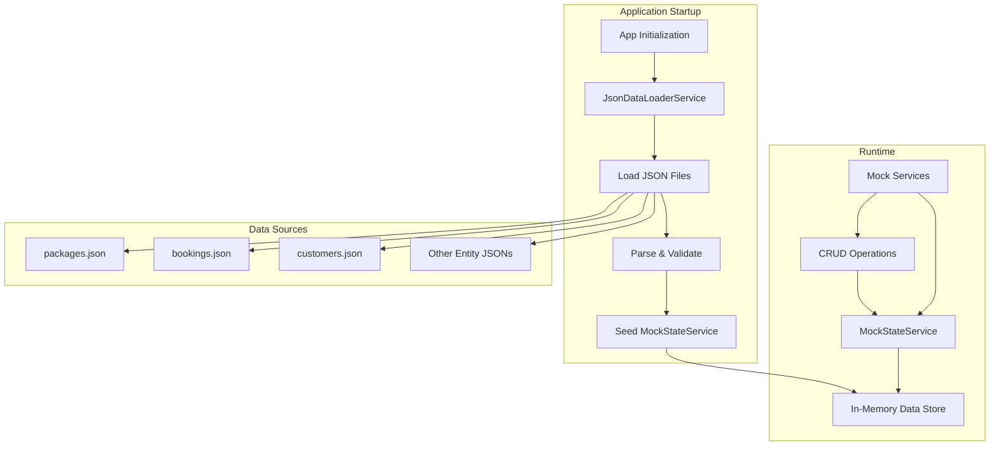
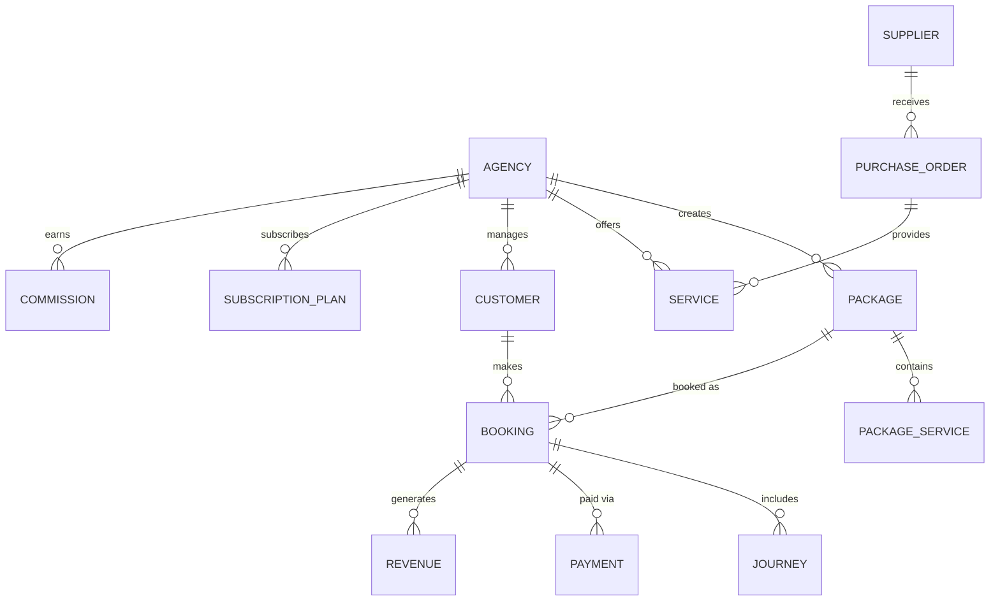

# Design Document: JSON-Based Mock Data System

## Overview

This design refactors the existing mock data system from factory-based random generation to JSON file-based static data. The new architecture introduces a JSON data loader service that reads static JSON files at application startup and loads them into the existing MockStateService. This ensures data consistency across all CRUD operations while maintaining backward compatibility with existing mock service interfaces.

The refactoring affects 12 mock services (agency, booking, commission, customer, journey, package, purchase-order, revenue, service, subscription-plan, supplier, and their associated factories). The core change is replacing factory instantiation and random data generation with JSON file loading, while preserving all existing service APIs.

## Architecture

### High-Level Architecture



### Directory Structure

```
src/
├── app/
│   └── core/
│       └── mock/
│           ├── data/                    # NEW: JSON data files
│           │   ├── packages.json
│           │   ├── bookings.json
│           │   ├── customers.json
│           │   ├── agencies.json
│           │   ├── suppliers.json
│           │   ├── services.json
│           │   ├── purchase-orders.json
│           │   ├── journeys.json
│           │   ├── subscription-plans.json
│           │   ├── commissions.json
│           │   ├── revenues.json
│           │   └── available-services.json
│           ├── services/
│           │   ├── json-data-loader.service.ts  # NEW
│           │   ├── package-mock.service.ts      # MODIFIED
│           │   ├── booking-mock.service.ts      # MODIFIED
│           │   └── ... (other mock services)    # MODIFIED
│           ├── factories/               # DEPRECATED (kept for reference)
│           ├── interfaces/
│           ├── mock-state.service.ts
│           └── base-mock-data.ts        # DEPRECATED
```

## Components and Interfaces

### 1. JsonDataLoaderService

**Purpose**: Centralized service for loading and parsing JSON data files.

**Interface**:
```typescript
interface JsonDataLoaderService {
  loadData<T>(entityType: string): T[];
  loadAllData(): Map<string, any[]>;
  resetData(entityType: string): void;
  resetAllData(): void;
}
```

**Responsibilities**:
- Load JSON files from the `/assets/mock-data/` directory
- Parse JSON content into typed TypeScript objects
- Handle file loading errors gracefully
- Cache loaded data to avoid redundant HTTP requests
- Provide methods to reset data to original JSON state

**Implementation Details**:
- Uses Angular's `HttpClient` to load JSON files as static assets
- Implements error handling with fallback to empty arrays
- Converts date strings to Date objects during parsing
- Validates basic structure (array format, required fields)
- Singleton service with `providedIn: 'root'`

### 2. Modified Mock Services

**Changes to Existing Services**:
- Remove factory class instantiation
- Remove `seedData()` method that generates random data
- Add JSON data loading in constructor via `JsonDataLoaderService`
- Maintain all existing public methods and return types
- Preserve Observable-based API patterns

**Example Refactored Service**:
```typescript
@Injectable({ providedIn: 'root' })
export class PackageMockService implements IPackageApiService {
  private readonly COLLECTION = 'packages';

  constructor(
    private mockState: MockStateService,
    private jsonLoader: JsonDataLoaderService
  ) {
    this.loadData();
  }

  private loadData(): void {
    if (this.mockState.count(this.COLLECTION) === 0) {
      const packages = this.jsonLoader.loadData<Package>(this.COLLECTION);
      this.mockState.seed(this.COLLECTION, packages);
    }
  }

  // All existing methods remain unchanged
  getAll(): Observable<Package[]> { /* ... */ }
  getById(id: string): Observable<Package> { /* ... */ }
  create(request: CreatePackageRequest): Observable<Package> { /* ... */ }
  update(id: string, request: UpdatePackageRequest): Observable<Package> { /* ... */ }
  publish(id: string): Observable<Package> { /* ... */ }
}
```

### 3. JSON Data Files

**File Naming Convention**: `{entity-type}.json` (plural, kebab-case)

**Structure**: Array of entity objects

**Example - packages.json**:
```json
[
  {
    "id": "package-1",
    "agency_id": "agency-1",
    "package_code": "PKG00001",
    "package_type": "umrah",
    "name": "Umrah Ekonomi",
    "description": "Premium umrah package with complete facilities",
    "duration_days": 14,
    "base_cost": 15000000,
    "markup_type": "percentage",
    "markup_value": 20,
    "selling_price": 18000000,
    "status": "published",
    "services": [],
    "created_at": "2024-01-15T10:00:00Z",
    "updated_at": "2024-01-20T15:30:00Z"
  }
]
```

**Date Handling**: Store dates as ISO 8601 strings, convert to Date objects during loading

### 4. Data Generation Script (Optional)

**Purpose**: Generate initial JSON files from existing factories for migration

**Implementation**:
```typescript
// scripts/generate-mock-data.ts
// Standalone script that uses existing factories to generate JSON files
// Run once during migration, then maintain JSON files manually
```

## Data Models

### Entity Relationships



### Key Data Models

All data models remain unchanged from the current implementation. The JSON files will store data matching these existing TypeScript interfaces:

- `Package` - Tour packages with pricing and services
- `Booking` - Customer bookings with travelers and payments
- `Customer` - Customer information
- `Agency` - Travel agency details
- `Supplier` - Service suppliers
- `Service` - Individual services (hotels, flights, etc.)
- `PurchaseOrder` - Orders from suppliers
- `Journey` - Travel itineraries
- `SubscriptionPlan` - Agency subscription tiers
- `Commission` - Commission configurations
- `Revenue` - Revenue tracking data

### Data Consistency Rules

1. **Foreign Key Integrity**: JSON files must maintain valid references between entities
2. **ID Uniqueness**: All entity IDs must be unique within their collection
3. **Date Ordering**: `created_at` must be <= `updated_at`
4. **Status Transitions**: Entity status values must be valid enum values
5. **Numeric Constraints**: Prices, quantities, and durations must be positive numbers

## Correctness Properties

*A property is a characteristic or behavior that should hold true across all valid executions of a system—essentially, a formal statement about what the system should do. Properties serve as the bridge between human-readable specifications and machine-verifiable correctness guarantees.*


### Property Reflection

After analyzing all acceptance criteria, I've identified the following redundancies:

1. **Data Loading Properties (1.2, 2.1)**: Both test that services load data from JSON. These can be combined into one comprehensive property about initialization.

2. **API Compatibility Properties (2.4, 7.4, 7.5)**: These all test that existing APIs are preserved. Can be combined into one property about interface compatibility.

3. **CRUD Consistency Properties (3.1, 3.2, 3.3, 3.4, 3.5)**: While each tests a different operation, they all validate the same underlying behavior - that operations work with shared in-memory state. These can be tested together as CRUD operation consistency.

4. **Session Persistence Properties (4.1, 4.5)**: Both test that changes persist during a session across services. These are essentially the same property.

5. **Referential Integrity Properties (6.3, 10.4)**: Both test that entity relationships are maintained. Duplicate property.

6. **Type Correctness Properties (8.2, 10.5)**: Both test that returned data has correct types. Can be combined.

After eliminating redundancies, the unique properties are:
- JSON data loading at initialization
- JSON structure validation
- CRUD operations consistency
- Session state persistence
- Data reset functionality
- JSON files remain unchanged
- Required fields completeness
- Data structure compatibility with factories
- Referential integrity
- API interface compatibility
- Error handling for invalid JSON
- Data caching behavior
- Invalid data logging

### Properties

**Property 1: JSON Data Initialization**

*For any* entity type with a corresponding JSON file, when the mock service initializes, the in-memory state should contain all entities from that JSON file.

**Validates: Requirements 1.2, 2.1**

---

**Property 2: JSON Structure Validation**

*For any* JSON file loaded by the system, if the JSON is valid and contains an array of objects, the system should successfully parse and load the data; if the JSON is invalid or malformed, the system should reject it and use empty data.

**Validates: Requirements 1.4, 1.5**

---

**Property 3: CRUD Operations Consistency**

*For any* entity type, all CRUD operations (create, read, update, delete) should operate on the same shared in-memory collection, such that:
- Creating an entity makes it retrievable via read
- Updating an entity changes the data returned by subsequent reads
- Deleting an entity makes it no longer retrievable

**Validates: Requirements 3.1, 3.2, 3.3, 3.4, 3.5**

---

**Property 4: Session State Persistence**

*For any* entity modification during a session, subsequent read operations across all mock services should reflect those changes, demonstrating that all services share the same in-memory state.

**Validates: Requirements 4.1, 4.5**

---

**Property 5: JSON File Immutability**

*For any* CRUD operation performed during a session, the original JSON files should remain unchanged, with all modifications existing only in memory.

**Validates: Requirements 4.3**

---

**Property 6: Data Reset Functionality**

*For any* entity type, after performing modifications and then calling reset, the in-memory state should match the original JSON file content.

**Validates: Requirements 4.4**

---

**Property 7: Required Fields Completeness**

*For any* entity loaded from JSON, all required fields as defined in the TypeScript interface should be present and have valid values.

**Validates: Requirements 5.3**

---

**Property 8: Factory-JSON Structure Compatibility**

*For any* entity type, objects loaded from JSON should have the same structure (same fields and types) as objects previously generated by factories.

**Validates: Requirements 6.2**

---

**Property 9: Referential Integrity**

*For any* entity with foreign key references (e.g., package.agency_id, booking.customer_id), those referenced entities should exist in their respective collections.

**Validates: Requirements 6.3, 10.4**

---

**Property 10: API Interface Compatibility**

*For any* mock service, all public methods defined in the original interface should remain available with the same signatures and return types (Observable-based).

**Validates: Requirements 2.4, 7.4, 7.5**

---

**Property 11: Graceful Error Handling**

*For any* loading error (missing file, malformed JSON, network error), the system should handle it gracefully without crashing, returning empty data and logging appropriate errors.

**Validates: Requirements 8.3**

---

**Property 12: Data Caching Behavior**

*For any* entity type, loading data multiple times should only read the JSON file once, with subsequent loads returning cached data.

**Validates: Requirements 2.5, 8.4**

---

**Property 13: Invalid Data Logging**

*For any* entity with missing or invalid fields, the system should log warnings while still loading the entity with default or null values for invalid fields.

**Validates: Requirements 9.4**

## Error Handling

### Error Scenarios and Responses

1. **Missing JSON File**
   - **Scenario**: JSON file for an entity type doesn't exist
   - **Response**: Log warning, initialize with empty array, continue operation
   - **User Impact**: No data available for that entity type until manually added

2. **Malformed JSON**
   - **Scenario**: JSON file contains invalid JSON syntax
   - **Response**: Log error with file name and parse error, use empty array
   - **User Impact**: No data available for that entity type

3. **Invalid Data Structure**
   - **Scenario**: JSON is valid but doesn't match expected entity structure
   - **Response**: Log warning for each invalid entity, skip invalid entries, load valid ones
   - **User Impact**: Some entities may be missing if they're invalid

4. **Missing Required Fields**
   - **Scenario**: Entity object missing required fields
   - **Response**: Log warning, use default values where possible, skip if critical fields missing
   - **User Impact**: Entity may have incomplete data or be skipped

5. **Invalid Foreign Key References**
   - **Scenario**: Entity references non-existent related entity
   - **Response**: Log warning, allow entity to load (don't enforce referential integrity at load time)
   - **User Impact**: May cause errors when trying to access related entities

6. **Date Parsing Errors**
   - **Scenario**: Date string in invalid format
   - **Response**: Log warning, use current date as fallback
   - **User Impact**: Entity will have incorrect date values

7. **HTTP Loading Errors**
   - **Scenario**: Network error or 404 when loading JSON file
   - **Response**: Log error, retry once, then use empty array
   - **User Impact**: No data available for that entity type

### Error Logging Strategy

All errors should be logged with:
- **Severity Level**: ERROR for critical issues, WARN for recoverable issues
- **Context**: Entity type, file name, specific field or record
- **Action Taken**: What fallback or recovery action was performed
- **Timestamp**: When the error occurred

Example log format:
```
[ERROR] JsonDataLoader: Failed to load packages.json - File not found. Using empty data.
[WARN] JsonDataLoader: Invalid date format in package-1.created_at. Using current date.
[WARN] JsonDataLoader: Missing required field 'name' in customer-5. Skipping entity.
```

## Testing Strategy

### Dual Testing Approach

The testing strategy combines unit tests for specific scenarios and property-based tests for universal properties:

**Unit Tests** focus on:
- Specific JSON file loading scenarios (valid file, missing file, malformed JSON)
- Edge cases (empty arrays, single entity, large datasets)
- Error handling paths (network errors, parse errors)
- Integration between JsonDataLoaderService and MockStateService
- Specific CRUD operation examples

**Property-Based Tests** focus on:
- Universal properties that hold for all entity types
- CRUD operation consistency across random data
- Data integrity across multiple operations
- State management correctness
- API compatibility verification

### Property-Based Testing Configuration

- **Framework**: Use `fast-check` library for TypeScript property-based testing
- **Iterations**: Minimum 100 iterations per property test
- **Test Tagging**: Each property test must include a comment referencing the design property

Tag format:
```typescript
// Feature: json-based-mock-data, Property 3: CRUD Operations Consistency
it('should maintain consistency across CRUD operations', () => {
  fc.assert(fc.property(/* ... */));
});
```

### Test Coverage Requirements

1. **JsonDataLoaderService Tests**
   - Load valid JSON files successfully
   - Handle missing files gracefully
   - Handle malformed JSON gracefully
   - Parse date strings correctly
   - Cache loaded data
   - Reset data to original state

2. **Mock Service Integration Tests**
   - Services initialize with JSON data
   - Services maintain backward compatibility
   - All entity types load correctly

3. **CRUD Operation Tests**
   - Create adds entities to shared state
   - Read retrieves correct entities
   - Update modifies entities in place
   - Delete removes entities from state
   - Operations are consistent across services

4. **Property-Based Tests**
   - All 13 correctness properties implemented
   - Each property tested with minimum 100 iterations
   - Tests cover multiple entity types

### Mock Data Generation for Testing

For property-based tests, use `fast-check` arbitraries to generate:
- Random entity objects matching TypeScript interfaces
- Random entity IDs
- Random foreign key references
- Random valid and invalid JSON structures
- Random date values

Example arbitrary:
```typescript
const packageArbitrary = fc.record({
  id: fc.string(),
  agency_id: fc.string(),
  package_code: fc.string(),
  package_type: fc.constantFrom('umrah', 'hajj', 'halal_tour', 'general_tour', 'custom'),
  name: fc.string(),
  description: fc.string(),
  duration_days: fc.integer({ min: 1, max: 30 }),
  base_cost: fc.integer({ min: 1000000, max: 50000000 }),
  markup_type: fc.constantFrom('percentage', 'fixed'),
  markup_value: fc.integer({ min: 0, max: 100 }),
  selling_price: fc.integer({ min: 1000000, max: 60000000 }),
  status: fc.constantFrom('draft', 'published', 'archived'),
  services: fc.array(fc.record({ /* ... */ })),
  created_at: fc.date(),
  updated_at: fc.date()
});
```
