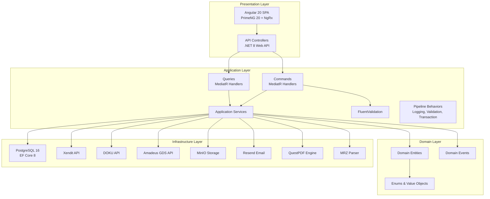
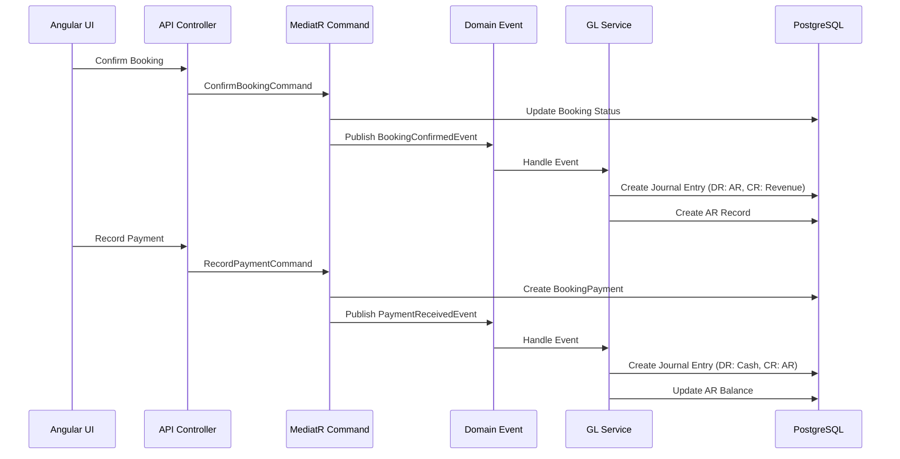
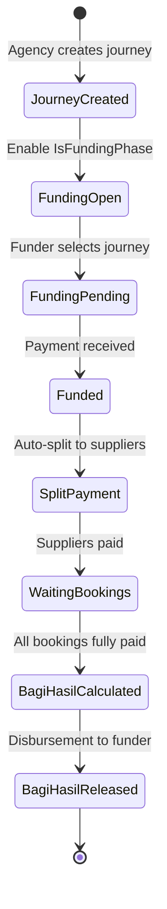
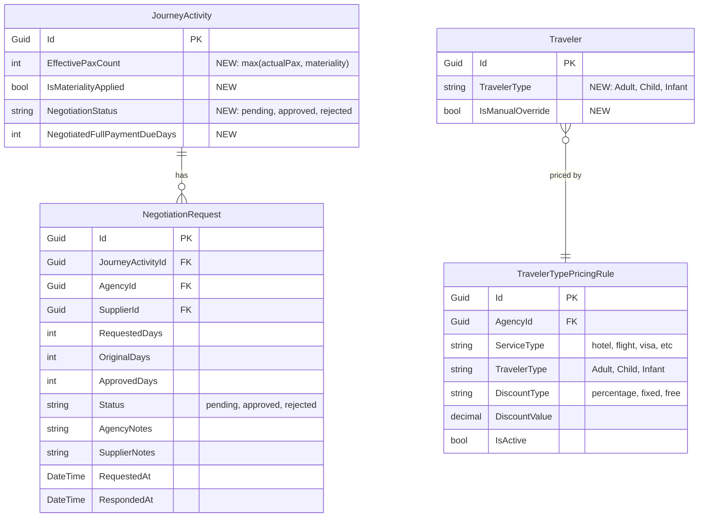
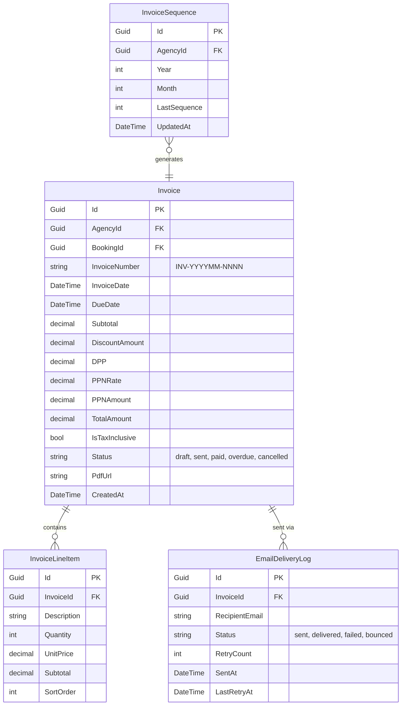
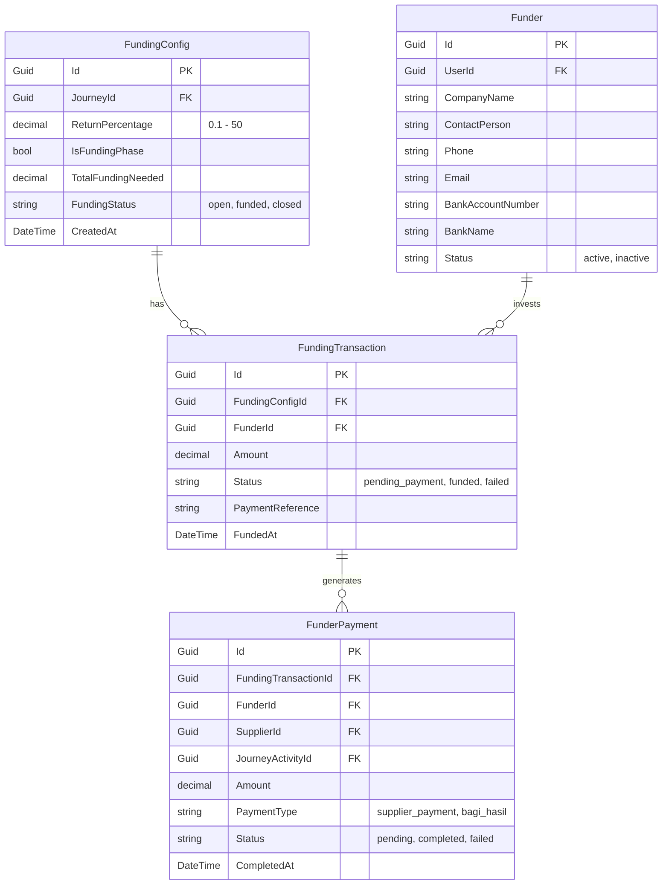
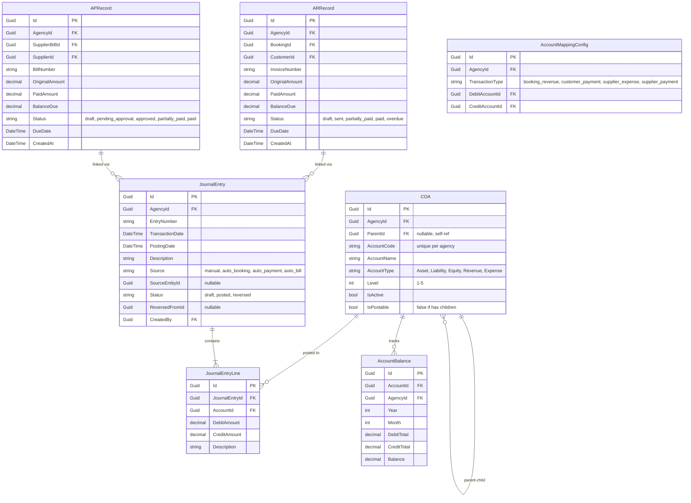
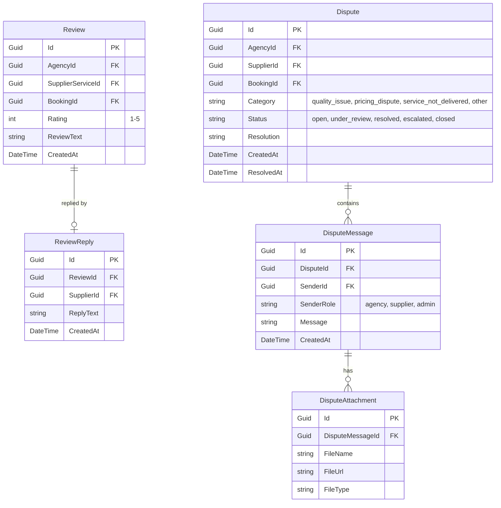
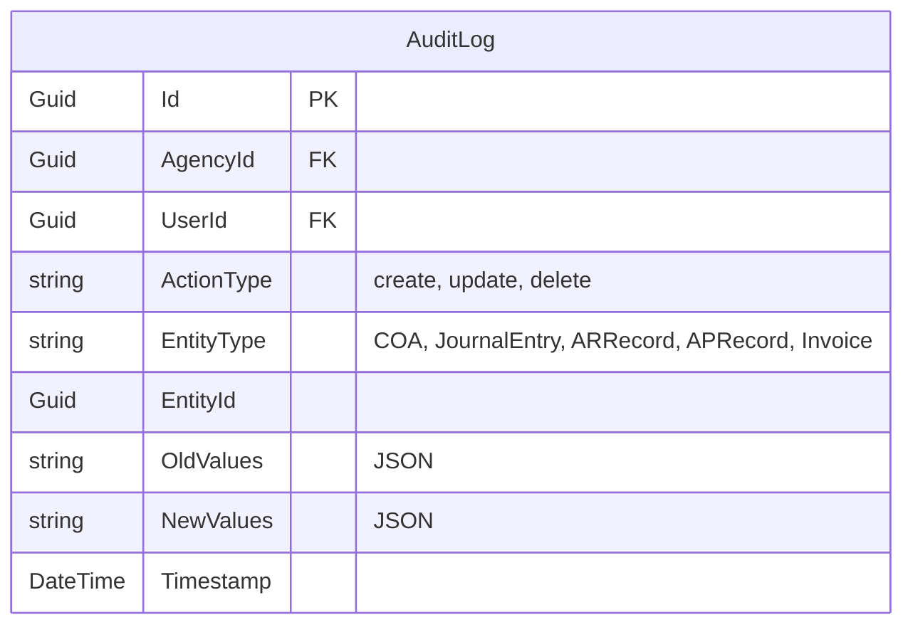

# Design Document — Phase 2 ERP Modules

## Overview

Dokumen ini mendeskripsikan desain teknis untuk Phase 2 pengembangan platform Tour & Travel SaaS. Phase 2 mencakup 9 modul utama yang dikelompokkan berdasarkan prioritas bisnis, mulai dari perbaikan kalkulasi harga (tech debt), payment gateway production test, invoice & PDF generation, integrasi Amadeus GDS, OCR passport, funder flow, finance & accounting (accrual basis IFRS), B2B marketplace enhancement, hingga reporting & analytics.

### Prinsip Desain

1. **Clean Architecture** — Domain layer tetap independen dari infrastructure concerns
2. **CQRS + MediatR** — Setiap operasi dipisahkan menjadi Command (write) dan Query (read) melalui MediatR pipeline
3. **Multi-Tenant RLS** — Semua entity baru menerapkan Row-Level Security berbasis `AgencyId` dari JWT context
4. **Event-Driven** — Business events (booking confirmed, payment received) memicu auto-generation journal entries dan notifikasi
5. **Accrual Basis Accounting** — Pencatatan keuangan mengikuti standar IFRS 19 (revenue recognition saat booking confirmed, bukan saat kas diterima)

### Scope Modul

| Prioritas | Modul | Deskripsi |
|-----------|-------|-----------|
| 🔴 1-3 | Modul 1: Tech Debt Calculation | Materiality pricing, negotiation FullPaymentDueDays, TravelerType |
| 🔴 1-3 | Modul 2: Payment Gateway Test | End-to-end DOKU production test |
| 🔴 1-3 | Modul 3: Invoice & PDF | QuestPDF engine, penomoran baru, PPN, email delivery |
| 🟡 4-7 | Modul 4: Amadeus Integration | Flight search & booking via GDS API |
| 🟡 4-7 | Modul 5: Passport OCR | Upload & MRZ parsing otomatis |
| 🟡 4-7 | Modul 6: Funder Flow | Role funder, funding config, bagi hasil |
| 🟡 4-7 | Modul 7: Finance & Accounting | COA, GL, AR, AP (accrual basis IFRS) |
| 🟢 8-9 | Modul 8: B2B Marketplace | Rating/review, dispute resolution, analytics |
| 🟢 8-9 | Modul 9: Reporting & Analytics | Laporan keuangan & operasional |

---

## Architecture

### High-Level Architecture

Arsitektur mengikuti pola Clean Architecture yang sudah ada di codebase, dengan penambahan layer dan service baru untuk Phase 2.



### Event-Driven Flow untuk Finance Module



### Funder Flow Architecture



---

## Components and Interfaces

### Modul 1: Tech Debt — Calculation Improvements

#### 1.1 MaterialityPriceCalculationService

Extends `PriceCalculationService` yang sudah ada untuk mendukung logika materiality.

```csharp
public interface IMaterialityPriceCalculationService
{
    Task<MaterialityPriceResult> CalculateWithMaterialityAsync(
        Guid supplierServiceId, 
        DateTime departureDate, 
        int actualPax);
}

public record MaterialityPriceResult
{
    public decimal EffectivePrice { get; init; }
    public string PriceSource { get; init; } // seasonal, availability, base
    public int ActualPax { get; init; }
    public int? MaterialityCount { get; init; }
    public int EffectivePaxCount { get; init; } // max(actualPax, materiality)
    public decimal TotalCost { get; init; }
    public bool IsMaterialityApplied { get; init; }
}
```

#### 1.2 NegotiationService

Service untuk mengelola negosiasi `FullPaymentDueDays` antara agency dan supplier.

```csharp
public interface INegotiationService
{
    Task<NegotiationRequest> CreateNegotiationAsync(CreateNegotiationCommand cmd);
    Task<NegotiationRequest> RespondNegotiationAsync(Guid negotiationId, bool approved, string? notes);
    Task<List<NegotiationRequest>> GetNegotiationHistoryAsync(Guid journeyActivityId);
}
```

#### 1.3 TravelerTypeService

Service untuk deteksi otomatis dan kalkulasi harga berdasarkan TravelerType.

```csharp
public interface ITravelerTypeService
{
    TravelerType DetectTravelerType(DateTime dateOfBirth, DateTime departureDate);
    Task<TravelerTypePricingResult> CalculateTravelerPriceAsync(
        Guid supplierServiceId, TravelerType travelerType, decimal basePrice);
}

public enum TravelerType { Adult, Child, Infant }
```

### Modul 2: Payment Gateway — DOKU Production Test

#### 2.1 DokuProductionTestService

Service khusus untuk orchestrate end-to-end test flow DOKU di production.

```csharp
public interface IDokuProductionTestService
{
    Task<DokuTestResult> RunEndToEndTestAsync(DokuTestRequest request);
    Task<ReconciliationResult> ManualReconciliationAsync(Guid bookingInvoiceId);
}
```

### Modul 3: Invoice & PDF Generation

#### 3.1 InvoiceNumberGenerator

Atomic sequential invoice number generator per agency per bulan.

```csharp
public interface IInvoiceNumberGenerator
{
    Task<string> GenerateNextAsync(Guid agencyId); // Returns INV-YYYYMM-NNNN
}
```

#### 3.2 TaxCalculationService

Service kalkulasi PPN 11% dengan dukungan inclusive/exclusive tax.

```csharp
public interface ITaxCalculationService
{
    TaxBreakdown CalculateTax(decimal amount, bool isTaxInclusive, decimal taxRate = 0.11m);
}

public record TaxBreakdown
{
    public decimal Subtotal { get; init; }
    public decimal DPP { get; init; } // Dasar Pengenaan Pajak
    public decimal PPN { get; init; }
    public decimal Total { get; init; } // Invariant: DPP + PPN == Total
}
```

#### 3.3 PdfInvoiceService

Service untuk generate PDF invoice menggunakan QuestPDF.

```csharp
public interface IPdfInvoiceService
{
    Task<byte[]> GenerateInvoicePdfAsync(Guid invoiceId);
    Task<byte[]> GenerateReceiptPdfAsync(Guid paymentId);
}
```

#### 3.4 InvoiceEmailService

Service untuk mengirim invoice PDF via email menggunakan Resend.

```csharp
public interface IInvoiceEmailService
{
    Task<EmailDeliveryResult> SendInvoiceEmailAsync(Guid invoiceId);
    Task<EmailDeliveryResult> ResendInvoiceEmailAsync(Guid invoiceId);
}
```

### Modul 4: Amadeus Integration

#### 4.1 AmadeusFlightSearchService

```csharp
public interface IAmadeusFlightSearchService
{
    Task<FlightSearchResult> SearchFlightsAsync(FlightSearchRequest request);
}

public record FlightSearchRequest
{
    public string Origin { get; init; }
    public string Destination { get; init; }
    public DateTime DepartureDate { get; init; }
    public DateTime? ReturnDate { get; init; }
    public int Adults { get; init; }
    public int Children { get; init; }
    public int Infants { get; init; }
    public string? CabinClass { get; init; }
    public string SearchType { get; init; } // one_way, round_trip, multi_city
}
```

#### 4.2 AmadeusFlightBookingService

```csharp
public interface IAmadeusFlightBookingService
{
    Task<FlightBookingResult> CreateBookingAsync(FlightBookingRequest request);
    Task<CancellationResult> CancelBookingAsync(string pnr);
}
```

### Modul 5: Passport OCR

#### 5.1 MrzParserService

```csharp
public interface IMrzParserService
{
    MrzData ParseMrz(string mrzText);
    string FormatToMrz(MrzData data);
}

public record MrzData
{
    public string FullName { get; init; }
    public DateTime DateOfBirth { get; init; }
    public string Gender { get; init; }
    public string Nationality { get; init; }
    public string PassportNumber { get; init; }
    public DateTime PassportExpiry { get; init; }
    public string IssuingCountry { get; init; }
}
```

#### 5.2 PassportOcrService

```csharp
public interface IPassportOcrService
{
    Task<OcrResult> ExtractPassportDataAsync(Stream imageStream, string fileName);
}
```

### Modul 6: Funder Flow

#### 6.1 FundingService

```csharp
public interface IFundingService
{
    Task<FundingConfig> ConfigureFundingAsync(ConfigureFundingCommand cmd);
    Task<FundingTransaction> CreateFundingTransactionAsync(Guid fundingConfigId, Guid funderId);
    Task ProcessFundingPaymentAsync(Guid fundingTransactionId);
    Task<BagiHasilResult> CalculateBagiHasilAsync(Guid journeyId);
    Task ReleaseBagiHasilAsync(Guid journeyId);
}
```

#### 6.2 FunderSplitPaymentService

```csharp
public interface IFunderSplitPaymentService
{
    Task<List<FunderPayment>> SplitPaymentToSuppliersAsync(Guid fundingTransactionId);
}
```

### Modul 7: Finance & Accounting

#### 7.1 ChartOfAccountsService

```csharp
public interface IChartOfAccountsService
{
    Task<COA> CreateAccountAsync(CreateCOACommand cmd);
    Task SeedDefaultAccountsAsync(Guid agencyId);
    Task<List<COA>> GetAccountTreeAsync(Guid agencyId);
    Task<bool> ValidatePostingAccountAsync(Guid accountId); // false if has children
}
```

#### 7.2 GeneralLedgerService

```csharp
public interface IGeneralLedgerService
{
    Task<JournalEntry> CreateJournalEntryAsync(CreateJournalEntryCommand cmd);
    Task<JournalEntry> ReverseJournalEntryAsync(Guid journalEntryId, string reason);
    Task<decimal> GetAccountBalanceAsync(Guid accountId, DateTime? asOfDate = null);
}
```

#### 7.3 AutoJournalService

Event handler yang auto-generate journal entries dari business events.

```csharp
public interface IAutoJournalService
{
    Task HandleBookingConfirmedAsync(BookingConfirmedEvent evt);   // DR: AR, CR: Revenue
    Task HandlePaymentReceivedAsync(PaymentReceivedEvent evt);     // DR: Cash, CR: AR
    Task HandleSupplierBillApprovedAsync(BillApprovedEvent evt);   // DR: Expense, CR: AP
    Task HandleSupplierPaymentAsync(SupplierPaymentEvent evt);     // DR: AP, CR: Cash
}
```

#### 7.4 AccountsReceivableService

```csharp
public interface IAccountsReceivableService
{
    Task<ARRecord> CreateReceivableAsync(Guid bookingId);
    Task ApplyPaymentAsync(Guid arRecordId, decimal amount);
    Task<AgingReport> GenerateAgingReportAsync(Guid agencyId, DateTime asOfDate);
}
```

#### 7.5 AccountsPayableService

```csharp
public interface IAccountsPayableService
{
    Task<APRecord> CreatePayableAsync(Guid supplierBillId);
    Task ApplyPaymentAsync(Guid apRecordId, decimal amount);
    Task<AgingReport> GenerateAgingReportAsync(Guid agencyId, DateTime asOfDate);
}
```

### Modul 8: B2B Marketplace Enhancement

#### 8.1 ReviewService

```csharp
public interface IReviewService
{
    Task<Review> CreateReviewAsync(CreateReviewCommand cmd);
    Task<ReviewReply> ReplyToReviewAsync(Guid reviewId, string replyText);
    Task<ReviewSummary> GetServiceReviewSummaryAsync(Guid supplierServiceId);
}
```

#### 8.2 DisputeService

```csharp
public interface IDisputeService
{
    Task<Dispute> CreateDisputeAsync(CreateDisputeCommand cmd);
    Task<Dispute> UpdateDisputeStatusAsync(Guid disputeId, string newStatus, string? resolution);
    Task<DisputeMessage> AddMessageAsync(Guid disputeId, string message, List<Guid>? attachmentIds);
}
```

### Modul 9: Reporting & Analytics

#### 9.1 FinancialReportService

```csharp
public interface IFinancialReportService
{
    Task<TrialBalanceReport> GenerateTrialBalanceAsync(Guid agencyId, DateTime from, DateTime to);
    Task<BalanceSheetReport> GenerateBalanceSheetAsync(Guid agencyId, DateTime asOfDate);
    Task<IncomeStatementReport> GenerateIncomeStatementAsync(Guid agencyId, DateTime from, DateTime to);
    Task<byte[]> ExportToPdfAsync<T>(T report) where T : class;
    Task<byte[]> ExportToExcelAsync<T>(T report) where T : class;
}
```

#### 9.2 OperationalReportService

```csharp
public interface IOperationalReportService
{
    Task<SalesReport> GenerateSalesReportAsync(Guid agencyId, DateTime from, DateTime to);
    Task<ProfitabilityReport> GenerateProfitabilityReportAsync(Guid agencyId, DateTime from, DateTime to);
    Task<CustomerReport> GenerateCustomerReportAsync(Guid agencyId, DateTime from, DateTime to);
    Task<SupplierReport> GenerateSupplierReportAsync(Guid agencyId, DateTime from, DateTime to);
}
```

### Cross-Module: Audit Trail

```csharp
public interface IAuditTrailService
{
    Task LogAsync(AuditLogEntry entry);
    Task<PaginatedResult<AuditLogEntry>> QueryAsync(AuditLogQuery query);
}
```

---

## Data Models

### Entity Relationship Diagram — Modul 1: Tech Debt



### Entity Relationship Diagram — Modul 3: Invoice & PDF



### Entity Relationship Diagram — Modul 6: Funder Flow



### Entity Relationship Diagram — Modul 7: Finance & Accounting



### Entity Relationship Diagram — Modul 8: B2B Marketplace



### Audit Trail Entity



### Tabel Entity Baru Phase 2 (Ringkasan)

| Entity | Modul | Deskripsi |
|--------|-------|-----------|
| `NegotiationRequest` | 1 | Riwayat negosiasi FullPaymentDueDays |
| `TravelerTypePricingRule` | 1 | Aturan harga per TravelerType per ServiceType |
| `InvoiceSequence` | 3 | Counter atomic nomor invoice per agency/bulan |
| `Invoice` | 3 | Invoice baru dengan format INV-YYYYMM-NNNN |
| `InvoiceLineItem` | 3 | Detail item invoice |
| `Funder` | 6 | Profil investor/funder |
| `FundingConfig` | 6 | Konfigurasi pendanaan per journey |
| `FundingTransaction` | 6 | Transaksi pendanaan funder |
| `FunderPayment` | 6 | Pembayaran dari/ke funder |
| `COA` | 7 | Chart of Accounts hierarki 5 level |
| `JournalEntry` | 7 | Header journal entry |
| `JournalEntryLine` | 7 | Line items debit/kredit |
| `AccountBalance` | 7 | Saldo akun per bulan |
| `ARRecord` | 7 | Piutang customer |
| `APRecord` | 7 | Hutang supplier |
| `AccountMappingConfig` | 7 | Mapping akun per tipe transaksi |
| `Review` | 8 | Rating & review supplier service |
| `ReviewReply` | 8 | Balasan supplier terhadap review |
| `Dispute` | 8 | Dispute ticket |
| `DisputeMessage` | 8 | Pesan dalam dispute thread |
| `DisputeAttachment` | 8 | Lampiran bukti dispute |
| `AuditLog` | Cross | Audit trail entity keuangan |

### Modifikasi Entity Existing

| Entity | Field Baru | Modul |
|--------|-----------|-------|
| `JourneyActivity` | `EffectivePaxCount`, `IsMaterialityApplied`, `NegotiationStatus`, `NegotiatedFullPaymentDueDays` | 1 |
| `Traveler` | `TravelerType` (enum), `IsManualOverride` (bool) | 1 |
| `SupplierService` | — (field `Materiality` dan `FullPaymentDueDays` sudah ada) | 1 |
| `Journey` | — (relasi ke `FundingConfig` ditambahkan) | 6 |


---

## Correctness Properties

*A property is a characteristic or behavior that should hold true across all valid executions of a system — essentially, a formal statement about what the system should do. Properties serve as the bridge between human-readable specifications and machine-verifiable correctness guarantees.*

### Property 1: Materiality effective pax calculation

*For any* `actualPax` (≥ 1) dan *for any* `materiality` (nullable int), `effectivePaxCount` yang dihitung oleh `MaterialityPriceCalculationService` SHALL sama dengan `max(actualPax, materiality ?? actualPax)`, dan `effectivePaxCount` SHALL selalu ≥ `actualPax`.

**Validates: Requirements 1.1.1, 1.1.2, 1.1.3, 1.1.6**

### Property 2: TravelerType auto-detection deterministic dan sesuai age bracket

*For any* `DateOfBirth` dan `DepartureDate` yang valid, `DetectTravelerType(dob, dep)` SHALL menghasilkan: Adult jika usia ≥ 12 tahun, Child jika usia 2–11 tahun, Infant jika usia < 2 tahun. Memanggil fungsi yang sama dua kali dengan input yang sama SHALL menghasilkan hasil yang identik (idempotence). Jika `DateOfBirth` null, hasil SHALL default ke Adult.

**Validates: Requirements 1.3.2, 1.3.7, 1.3.9**

### Property 3: TravelerType pricing — total harga journey = sum harga per-traveler

*For any* list of travelers dengan TravelerType masing-masing dan *for any* pricing rules yang berlaku, total harga journey yang dihitung SHALL sama dengan penjumlahan harga individual setiap traveler berdasarkan TravelerType-nya.

**Validates: Requirements 1.3.5, 1.3.8**

### Property 4: Invoice numbering — sequential, gapless, unique, dan format valid

*For any* N invoice yang di-generate dalam satu agency dan satu bulan, nomor invoice SHALL mengikuti format `INV-YYYYMM-NNNN`, sequence number SHALL berurutan dari 0001 sampai N tanpa gap, dan semua nomor invoice SHALL unik dalam satu agency.

**Validates: Requirements 3.2.1, 3.2.2, 3.2.5, 3.2.6**

### Property 5: Tax calculation — DPP + PPN = Total (invariant)

*For any* amount (> 0) dan *for any* mode (tax-inclusive atau tax-exclusive) dengan tax rate yang dikonfigurasi, hasil kalkulasi `TaxCalculationService` SHALL memenuhi invariant: `DPP + PPN == Total`. Untuk mode tax-inclusive: `DPP = Total / (1 + rate)`. Untuk mode tax-exclusive: `PPN = DPP × rate`.

**Validates: Requirements 3.3.1, 3.3.4, 3.3.5, 3.3.6, 3.3.7**

### Property 6: MRZ round-trip — parse kemudian format menghasilkan data equivalent

*For any* valid `MrzData`, `ParseMrz(FormatToMrz(data))` SHALL menghasilkan `MrzData` yang equivalent dengan input original.

**Validates: Requirements 5.1.9**

### Property 7: Funding list filtering — journey muncul iff IsFundingPhase = true

*For any* journey dengan `FundingConfig`, journey SHALL muncul di Funding List jika dan hanya jika `IsFundingPhase == true` dan `FundingStatus == "open"`. Journey dengan `IsFundingPhase == false` SHALL tidak pernah muncul di Funding List.

**Validates: Requirements 6.2.3, 6.2.5**

### Property 8: ReturnPercentage validation — range 0.1% sampai 50%

*For any* nilai `ReturnPercentage`, validasi SHALL menerima nilai dalam range [0.1, 50.0] dan menolak nilai di luar range tersebut.

**Validates: Requirements 6.2.4**

### Property 9: Bagi hasil calculation — amount = profit × return percentage

*For any* journey yang didanai dengan `SellingPrice`, `BaseCost`, dan `ReturnPercentage`, jumlah bagi hasil yang dihitung SHALL sama dengan `(SellingPrice - BaseCost) × ReturnPercentage / 100`.

**Validates: Requirements 6.5.1, 6.5.2, 6.5.6**

### Property 10: COA tree — traversal dari child ke root menghasilkan valid path

*For any* akun dalam COA hierarchy, mengikuti parent links dari akun tersebut SHALL mencapai root (akun tanpa parent) tanpa cycle, dan kedalaman path SHALL ≤ 5 level.

**Validates: Requirements 7.1.2, 7.1.7**

### Property 11: COA posting restriction — parent account tidak bisa di-posting

*For any* akun yang memiliki child accounts, operasi posting journal entry ke akun tersebut SHALL ditolak. Hanya leaf accounts (tanpa children) yang boleh menerima posting.

**Validates: Requirements 7.1.5**

### Property 12: Journal entry balance — total debit = total kredit

*For any* journal entry (manual maupun auto-generated), jumlah total semua `DebitAmount` pada line items SHALL sama dengan jumlah total semua `CreditAmount`. Journal entry yang tidak balanced SHALL ditolak oleh validasi.

**Validates: Requirements 7.2.2, 7.2.8, 7.3.6**

### Property 13: Account balance confluence — urutan journal entries tidak mempengaruhi saldo akhir

*For any* set of journal entries yang di-apply ke satu set akun, menerapkan journal entries dalam urutan permutasi apapun SHALL menghasilkan saldo akhir yang identik untuk setiap akun.

**Validates: Requirements 7.2.9**

### Property 14: AR payment invariant — total pembayaran ≤ jumlah piutang

*For any* `ARRecord`, setelah serangkaian operasi `ApplyPayment`, `PaidAmount` SHALL tidak pernah melebihi `OriginalAmount`.

**Validates: Requirements 7.4.8**

### Property 15: AP payment invariant — total pembayaran ≤ jumlah bill

*For any* `APRecord`, setelah serangkaian operasi `ApplyPayment`, `PaidAmount` SHALL tidak pernah melebihi `OriginalAmount`.

**Validates: Requirements 7.5.8**

### Property 16: Rating range invariant — nilai rating 1-5

*For any* review yang dibuat, nilai `Rating` SHALL berada dalam range [1, 5]. Nilai di luar range tersebut SHALL ditolak oleh validasi.

**Validates: Requirements 8.1.6**

### Property 17: Balance Sheet accounting equation — Assets = Liabilities + Equity

*For any* Balance Sheet yang di-generate pada tanggal apapun, total Assets SHALL sama dengan total Liabilities + total Equity.

**Validates: Requirements 9.1.6**

### Property 18: Trial Balance — total debit = total kredit

*For any* Trial Balance yang di-generate untuk periode apapun, total kolom debit SHALL sama dengan total kolom kredit.

**Validates: Requirements 9.1.7**

### Property 19: Review average calculation

*For any* set of ratings untuk satu supplier service, rata-rata yang ditampilkan SHALL sama dengan `sum(ratings) / count(ratings)` (dengan pembulatan yang konsisten).

**Validates: Requirements 8.1.3**

---

## Error Handling

### Strategi Error Handling per Layer

| Layer | Strategi | Contoh |
|-------|----------|--------|
| **Domain** | Throw `BusinessRuleException` / `BusinessRuleViolationException` | Journal entry tidak balanced, payment melebihi piutang |
| **Application** | Throw `ValidationException` via FluentValidation, `NotFoundException`, `BadRequestException` | Invalid input, entity not found |
| **Infrastructure** | Catch external API errors, wrap dalam custom exceptions | Amadeus API timeout, DOKU webhook signature invalid |
| **API** | Global exception handler middleware, return standardized error response | HTTP 400/404/422/500 |

### Error Handling per Modul

#### Modul 1: Tech Debt
- `Materiality` null → skip materiality logic, gunakan pax aktual (bukan error)
- `DateOfBirth` null → default TravelerType ke Adult (bukan error)
- Negotiation pada service tanpa `PaymentTermsEnabled` → throw `BusinessRuleException`

#### Modul 2: Payment Gateway
- DOKU API timeout → retry dengan exponential backoff (max 3 retries)
- Webhook signature invalid → log warning, return HTTP 400, jangan update status
- Webhook tidak diterima dalam 5 menit → manual reconciliation endpoint tersedia

#### Modul 3: Invoice & PDF
- Concurrent invoice generation → atomic sequence via database lock (`SELECT FOR UPDATE`)
- PDF generation failure → return error, jangan kirim email
- Email delivery failure → retry hingga 3 kali dengan exponential backoff, catat status "failed"
- Tax calculation dengan amount ≤ 0 → throw `BadRequestException`

#### Modul 4: Amadeus Integration
- Amadeus API unavailable → return user-friendly error message, suggest retry
- Flight booking failure → rollback local booking record, notify user
- Cache miss setelah 15 menit → re-fetch dari Amadeus API

#### Modul 5: Passport OCR
- OCR gagal extract data → return partial result + error message, allow manual input
- File format tidak didukung → throw `BadRequestException` dengan supported formats
- File size terlalu besar → throw `BadRequestException` dengan max size info

#### Modul 6: Funder Flow
- `ReturnPercentage` di luar range [0.1, 50] → throw `ValidationException`
- Split payment ke supplier gagal → retry + log untuk manual reconciliation
- Journey belum fully funded → prevent split payment, return status info
- Bagi hasil calculation pada journey tanpa profit → return 0, log warning

#### Modul 7: Finance & Accounting
- Journal entry tidak balanced (debit ≠ kredit) → throw `BusinessRuleException`, jangan simpan
- Posting ke parent account (non-leaf) → throw `BusinessRuleException`
- Payment melebihi piutang/hutang → throw `BusinessRuleException`
- Duplicate account code dalam agency → throw `BusinessRuleException` (unique constraint)
- Reversal pada entry yang sudah di-reverse → throw `BusinessRuleException`

#### Modul 8: B2B Marketplace
- Duplicate review (same booking + service) → throw `BusinessRuleException`
- Review oleh agency yang belum menggunakan service → throw `ForbiddenException`
- Rating di luar range 1-5 → throw `ValidationException`

#### Modul 9: Reporting
- Report generation timeout (> 10 detik) → return partial result + warning
- No data untuk periode yang diminta → return empty report, bukan error

---

## Testing Strategy

### Pendekatan Dual Testing

Phase 2 menggunakan kombinasi **unit tests** (example-based) dan **property-based tests** untuk coverage yang komprehensif.

### Property-Based Testing (PBT)

**Library:** [FsCheck](https://fscheck.github.io/FsCheck/) untuk .NET 8 (atau [Hedgehog](https://github.com/hedgehogqa/fsharp-hedgehog) sebagai alternatif)

**Konfigurasi:**
- Minimum **100 iterations** per property test
- Setiap property test HARUS mereferensikan property dari design document
- Tag format: `Feature: phase-2-erp-modules, Property {number}: {property_text}`

**Property Tests yang Harus Diimplementasikan:**

| Property | Modul | Deskripsi | Complexity |
|----------|-------|-----------|------------|
| 1 | Tech Debt | Materiality effective pax = max(actual, materiality) | Low |
| 2 | Tech Debt | TravelerType detection deterministic + age bracket | Low |
| 3 | Tech Debt | Total harga = sum harga per-traveler | Medium |
| 4 | Invoice | Invoice numbering sequential, gapless, unique | Medium |
| 5 | Invoice | DPP + PPN = Total (tax invariant) | Low |
| 6 | Passport | MRZ parse/format round-trip | Medium |
| 7 | Funder | Funding list filtering IsFundingPhase | Low |
| 8 | Funder | ReturnPercentage range validation | Low |
| 9 | Funder | Bagi hasil = profit × percentage | Low |
| 10 | Finance | COA tree traversal valid path ≤ 5 levels | Medium |
| 11 | Finance | Parent account posting restriction | Low |
| 12 | Finance | Journal entry debit = kredit | Low |
| 13 | Finance | Account balance confluence (order-independent) | High |
| 14 | Finance | AR payment ≤ original amount | Low |
| 15 | Finance | AP payment ≤ original amount | Low |
| 16 | Marketplace | Rating range 1-5 | Low |
| 17 | Reporting | Balance Sheet: Assets = Liabilities + Equity | High |
| 18 | Reporting | Trial Balance: debit = kredit | Medium |
| 19 | Marketplace | Review average calculation | Low |

### Unit Tests (Example-Based)

Unit tests fokus pada:
- **Specific scenarios**: Negotiation flow steps, dispute workflow transitions
- **Edge cases**: Null materiality, empty DateOfBirth, zero amount
- **Integration points**: DOKU webhook handling, Amadeus API response parsing
- **Error conditions**: Invalid inputs, unauthorized access, business rule violations

### Integration Tests

Integration tests untuk:
- **External APIs**: DOKU production test, Amadeus flight search/booking
- **Database**: RLS enforcement, concurrent invoice generation, audit trail
- **Email**: Resend API delivery, retry mechanism
- **File Storage**: MinIO passport upload

### Test Organization

```
TourTravel.Tests/
├── Unit/
│   ├── Application/
│   │   ├── MaterialityPriceCalculationTests.cs
│   │   ├── TravelerTypeServiceTests.cs
│   │   ├── TaxCalculationServiceTests.cs
│   │   ├── InvoiceNumberGeneratorTests.cs
│   │   ├── MrzParserServiceTests.cs
│   │   ├── BagiHasilCalculationTests.cs
│   │   ├── GeneralLedgerServiceTests.cs
│   │   ├── ChartOfAccountsServiceTests.cs
│   │   ├── AccountsReceivableServiceTests.cs
│   │   ├── AccountsPayableServiceTests.cs
│   │   └── ReviewServiceTests.cs
│   └── Domain/
│       ├── TravelerTypeEnumTests.cs
│       └── JourneyActivityTests.cs
├── Property/
│   ├── MaterialityPropertyTests.cs          // Property 1
│   ├── TravelerTypePropertyTests.cs         // Property 2, 3
│   ├── InvoiceNumberPropertyTests.cs        // Property 4
│   ├── TaxCalculationPropertyTests.cs       // Property 5
│   ├── MrzRoundTripPropertyTests.cs         // Property 6
│   ├── FundingFilterPropertyTests.cs        // Property 7, 8
│   ├── BagiHasilPropertyTests.cs            // Property 9
│   ├── COATreePropertyTests.cs              // Property 10, 11
│   ├── JournalEntryPropertyTests.cs         // Property 12, 13
│   ├── ARPaymentPropertyTests.cs            // Property 14
│   ├── APPaymentPropertyTests.cs            // Property 15
│   ├── RatingPropertyTests.cs               // Property 16, 19
│   └── FinancialReportPropertyTests.cs      // Property 17, 18
└── Integration/
    ├── DokuPaymentIntegrationTests.cs
    ├── AmadeusIntegrationTests.cs
    ├── PassportOcrIntegrationTests.cs
    ├── EmailDeliveryIntegrationTests.cs
    ├── RLSIntegrationTests.cs
    └── AuditTrailIntegrationTests.cs
```

### Frontend Testing (Angular)

- **Component tests**: PrimeNG form components, data tables, PDF preview
- **NgRx store tests**: State management untuk setiap modul
- **E2E tests**: Critical user flows (invoice generation, journal entry creation, funding flow)
- **Library**: Jasmine + Karma (unit), Cypress atau Playwright (E2E)
