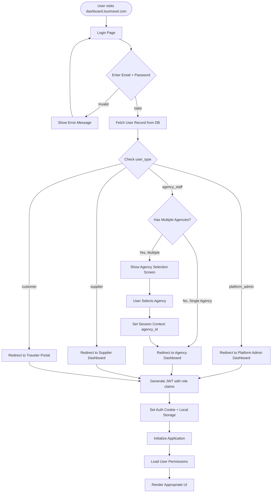

# Tour & Travel Agency ERP SaaS - Complete Technical Documentation v2

**Project:** Multi-Tenant Tour & Travel Agency ERP SaaS Platform

**Focus:** Umrah, Hajj, Tour Packages

**Tech Stack:** Angular 20 + .NET 8 + PostgreSQL 16

**Date:** February 2026

**Version:** 2.0

**MVP Demo Target:** April 26, 2026

**🚨 Go Live Target:** June 16, 2026

---

## 📍 Navigation

**Quick Links:**
- 🏠 [Back to README](README.md)
- 📋 [Documentation Summary](DOCUMENTATION-SUMMARY.md)
- ⏰ [Timeline & Scope Changes](TIMELINE-ADJUSTMENT.md)
- 🚀 [Phase 1 Implementation Guide](phase-1/PHASE-1-COMPLETE-DOCUMENTATION.md)
- ✅ [Phase 1 Features Checklist](phase-1/PHASE-1-FEATURES-RECAP.md)

---

## 📋 Table of Contents

1. [Executive Summary](#executive-summary)
2. [Project Phases & Timeline](#project-phases--timeline)
3. [System Architecture Overview](#system-architecture-overview)
4. [Module Specifications](#module-specifications)
5. [User Flows - Detailed](#user-flows---detailed)
6. [Database Schema - Complete](#database-schema---complete)
7. [API Design & Endpoints](#api-design--endpoints)
8. [Frontend Structure - Angular](#frontend-structure---angular)
9. [Backend Structure - .NET](#backend-structure---net)
10. [Security & Multi-tenancy](#security--multi-tenancy)
11. [Deployment Architecture](#deployment-architecture)

---

## Executive Summary

### 🎯 Platform Overview

**Multi-Tenant SaaS** untuk tour & travel agencies dengan 4 aktor utama:

```
┌─────────────────────────────────────────────────────────────┐
│         PLATFORM ADMIN (Super Admin/Owner)                  │
│  • Manage agencies (tenants)                                │
│  • Settlement engine (escrow → agencies + suppliers)        │
│  • Commission & fee configuration                           │
│  • Compliance & dispute resolution                          │
└─────────────────────────────────────────────────────────────┘
                              │
        ┌─────────────────────┴─────────────────────┐
        │     PostgreSQL (Single DB + RLS)          │
        │     tenant_id isolation                   │
        └─────────────────────┬─────────────────────┘
                              │
    ┌─────────────────────────┼─────────────────────────┐
    │                         │                         │
┌───▼─────┐          ┌────────▼────────┐      ┌────────▼──────┐
│Agency A │          │  Supplier Portal│      │Traveler Portal│
│(Tenant) │          │  (B2B Dashboard)│      │ (B2C Website) │
│ERP Ops  │          │  Service Catalog│      │ Browse & Book │
└─────────┘          └─────────────────┘      └───────────────┘
```

### 🔑 Key Features Summary

| Feature | Details |
| --- | --- |
| **Multi-tenancy** | Single database, Row-Level Security (RLS) |
| **Supplier Model** | Hybrid (marketplace shared + private) |
| **Traveler Portal** | Hybrid (self-service + staff booking) |
| **Revenue Model** | Subscription + Transaction commission (configurable) |
| **Booking Flow** | Both staff manual + customer self-service |
| **Inventory** | Allotment-based + supplier dashboard input |
| **Payment** | Escrow model via payment gateway |
| **Settlement** | Platform admin settles to agencies & suppliers |

---


## Project Phases & Timeline

### 🎯 MVP Demo Target: April 26, 2026

**Total Development Time:** 10 weeks (Feb 16 - Apr 26, 2026)

---

### **PHASE 1 - MVP Demo (Feb 16 - Apr 26, 2026)** ⭐

**Duration:** 10 weeks

**Goal:** Proof of concept - Happy path booking flow for demo

**Demo Scope:** User dapat melakukan booking transaksi + Supplier dapat create service

#### Week 1-2: Foundation & Backend Core
- [ ] Project setup (Angular + .NET 8 + PostgreSQL)
- [ ] Database schema creation (all tables, populate Phase 1 data only)
- [ ] Authentication & Authorization (JWT, multi-role login)
- [ ] Multi-tenancy setup (RLS policies)
- [ ] Core API endpoints (CRUD for agencies, suppliers, services)

#### Week 3-4: Supplier & Package Management
- [ ] Platform Admin: Agency onboarding (simplified)
- [ ] Supplier Portal: Registration & service creation
- [ ] Supplier Portal: Service management (CRUD)
- [ ] Agency Portal: Browse supplier services
- [ ] Agency Portal: Package creation (basic)

#### Week 5-6: Purchase Orders & Booking Flow
- [ ] Agency Portal: Create Purchase Order to Supplier
- [ ] Agency Portal: View PO list and status
- [ ] Supplier Portal: View incoming POs
- [ ] Supplier Portal: Approve/reject PO
- [ ] Agency Portal: Create package from approved PO
- [ ] Traveler Portal: Browse packages
- [ ] Traveler Portal: Package detail & booking form
- [ ] Traveler Portal: Submit booking
- [ ] Agency Portal: View pending bookings
- [ ] Agency Portal: Approve/reject booking

#### Week 7-8: Dashboard & UI Polish
- [ ] Platform Admin dashboard (basic metrics)
- [ ] Agency dashboard (pending bookings, revenue mock)
- [ ] Supplier dashboard (services, booking requests)
- [ ] Traveler dashboard (my bookings)
- [ ] UI/UX refinement

#### Week 9: Integration & Testing
- [ ] End-to-end testing (happy path)
- [ ] Bug fixes
- [ ] Performance optimization
- [ ] Demo data preparation

#### Week 10: Demo Preparation
- [ ] Demo script preparation
- [ ] Rehearsal (3x minimum)
- [ ] Backup demo data
- [ ] Presentation materials

#### Phase 1 Features (MVP Demo):

**✅ Included:**
- Multi-role authentication (Platform Admin, Agency, Supplier, Traveler)
- Agency onboarding (basic info only)
- Supplier registration & service creation (Hotel, Flight, Visa, Transport, Guide)
- Purchase Order workflow (Agency creates PO → Supplier approves/rejects → Agency creates package from approved PO)
- Package creation (basic info + services + markup pricing + PO linking)
- Booking flow (browse → book → approve)
- Basic dashboards for all roles
- Responsive web application

**❌ Excluded (Tech Debt for Phase 2):**
- Payment gateway integration (mock payment status)
- Document upload (text input only)
- Email notifications (show in UI only)
- Installment payment
- Pricing tiers (early bird, last minute)
- Itinerary builder
- Invoice generation
- Settlement processing
- Advanced reporting
- File uploads
- Complex validation rules

**Database:** Core tables only (users, agencies, suppliers, supplier_services, packages, package_services, bookings, travelers, purchase_orders, po_items)

**Acceptable Tech Debt:**
- Hardcoded master data (currencies, locations)
- No caching (direct DB queries)
- Minimal validation
- No email service
- No file storage service

---

### **PHASE 2 - Production MVP (Apr 27 - May 24, 2026)** ⚡ COMPRESSED

**Duration:** 4 weeks (compressed from 8 weeks)

**Goal:** Production-ready MVP with payment & document management

#### Features to Add:

**A) Payment Integration**
- Midtrans/Xendit integration
- Payment webhook handling
- Payment history tracking

**B) Document Management**
- File upload (S3/local storage)
- Document validation (passport, visa, vaccination)
- Basic document tracking

**C) Finance Module (Simplified)**
- Invoice generation (PDF)
- Receipt generation
- Payment tracking
- Basic financial reports (revenue, outstanding payments)

**D) Email Notifications**
- Booking confirmation email
- Approval/rejection notification
- Email templates (basic)

**E) Enhanced Package Creation**
- Pricing tiers (early bird, regular, last minute)
- Itinerary builder (day-by-day text)
- Document requirements checklist

**F) CRM Module (Basic)**
- Customer master data
- Customer history (bookings only)

**G) Reporting**
- Booking reports (by date, status, package)
- Revenue reports (by period, agency)
- Export to Excel/PDF

**❌ Deferred to Phase 4:**
- Installment payment
- Refund processing
- Payment reminders
- Document approval workflow
- Expiry alerts
- Advanced email templates
- Lead management
- Contact management
- Customer segmentation

---

### **PHASE 3 - Go Live (May 25 - Jun 16, 2026)** ⚡ HIGHLY COMPRESSED

**Duration:** 3 weeks (compressed from 12 weeks)

**Goal:** Essential ERP features for go live

#### Features to Add:

**A) Operations & Task Management (Simple)**
- Task board (simple Kanban)
- Task assignment
- Checklist per booking stage

**C) Finance (Basic)**
- Supplier bills & payables (basic)
- Settlement engine (manual)
- Profitability reports (per trip, booking)

**D) CRM (Basic)**
- Lead pipeline (basic)
- Quotation workflow (simplified)

**E) Pricing (Basic)**
- Advanced pricing rules (basic)
- Tier pricing (volume-based)

**F) Supplier Management (Basic)**
- Supplier performance tracking (basic)

**G) Compliance (Basic)**
- Audit trail (basic)

**❌ Deferred to Phase 4:**
- Supplier contract management
- Rate card management
- Tour leader assignment
- Incident logging
- Automated settlement
- Multi-currency
- FX gains/losses
- Cash/bank management
- Dunning system
- Lead scoring
- Campaign tracking
- Seasonal pricing
- Dynamic pricing engine
- Add-ons & bundles
- Supplier rating system
- Complaint management
- Custom report builder
- Dashboard customization

---

### **PHASE 4 - Post-Launch Enhancements (Jun 17, 2026+)**

**Duration:** Ongoing

**Goal:** Add deferred features & advanced capabilities

#### Features to Add:

**A) Deferred Features from Phase 2 & 3**
- All features listed as deferred above

**B) Advanced Analytics & BI**
- Real-time dashboards
- Predictive analytics
- Customer lifetime value (CLV)
- Churn prediction
- Revenue forecasting

**C) API & Integrations**
- Public API for third-party integrations
- Webhook system
- API documentation (Swagger)
- Rate limiting & throttling

**D) White-label Capability**
- Custom branding per agency
- Custom domain support
- Theme customization
- Logo & color scheme

**E) Advanced Automation**
- Automated task assignment
- Automated email campaigns
- Automated payment reminders
- Automated document validation

**F) Mobile Optimization**
- Progressive Web App (PWA)
- Offline capability
- Push notifications

**G) Advanced Security**
- Two-factor authentication (2FA)
- IP whitelisting
- Session management
- Security audit reports

---

### 📊 Timeline Summary

| Phase | Duration | Start Date | End Date | Key Deliverable |
|-------|----------|------------|----------|-----------------|
| **Phase 1** | 10 weeks | Feb 16, 2026 | Apr 26, 2026 | MVP Demo (Booking Flow + PO) |
| **Phase 2** | 4 weeks | Apr 27, 2026 | May 24, 2026 | Production MVP (Payment & Docs) |
| **Phase 3** | 3 weeks | May 25, 2026 | Jun 16, 2026 | Go Live (Essential ERP) |
| **Phase 4** | Ongoing | Jun 17, 2026+ | - | Post-Launch Enhancements |

**Total Duration to Go Live:** 17 weeks (~4 months)

**🚨 CRITICAL:** Go Live target is **June 16, 2026**. Timeline compressed from 30 weeks to 17 weeks.

---
## User Flows - Phase 1 (MVP Demo)

### Flow 1: Platform Admin - Agency Onboarding (Simplified)

**Goal:** Platform admin dapat create agency baru dengan cepat

**Steps:**
1. Platform admin login
2. Navigate to "Agencies" menu
3. Click "Add New Agency"
4. Fill form:
   - Company name
   - Email
   - Phone
   - Subscription plan (Basic/Pro/Enterprise)
5. Submit
6. System creates:
   - Agency record
   - Default admin user
   - Temporary password
7. Platform admin manually shares credentials with agency owner (email/WhatsApp)

**Phase 1 Simplifications:**
- No welcome email (manual sharing)
- No setup wizard (agency can start using immediately)
- No branch setup (single branch assumed)
- No payment config (manual setup later)

---

### Flow 2: Supplier - Service Creation

**Goal:** Supplier dapat publish service ke marketplace

**Steps:**
1. Supplier login (after manual approval by platform admin)
2. Navigate to "Services" menu
3. Click "Add New Service"
4. Select service type (Hotel/Flight/Visa/Transport/Guide)
5. Fill service details:
   - **Hotel:** Name, location, star rating, room types, price per night
   - **Flight:** Airline, route, departure time, price per pax
   - **Visa:** Type, processing time, price per pax
   - **Transport:** Vehicle type, capacity, price per trip
   - **Guide:** Name, language, price per day
6. Set pricing (base price in IDR)
7. Set visibility: Marketplace (public)
8. Save as Draft
9. Review preview
10. Click "Publish"
11. Service now visible to all agencies

**Phase 1 Simplifications:**
- No photo upload (text description only)
- No availability calendar (assumed always available)
- No private assignment (marketplace only)
- No complex pricing rules (flat price only)

---

### Flow 3: Agency - Purchase Order Creation

**Goal:** Agency dapat create Purchase Order ke Supplier untuk request services

**Steps:**
1. Agency staff login
2. Navigate to "Purchase Orders" menu
3. Click "Create New PO"
4. Select supplier from dropdown
5. Add PO items:
   - Click "Add Item"
   - Select service from supplier's catalog
   - Enter quantity (e.g., 10 nights for hotel)
   - Unit price auto-filled from service
   - Item total calculated: quantity × unit price
   - Repeat for multiple services
6. System calculates PO total amount
7. Review PO summary
8. Submit PO
9. System creates PO (status: Pending)
10. PO code generated: PO-260211-001
11. Supplier receives notification

**Phase 1 Simplifications:**
- No email notification (in-app only)
- No PO terms & conditions
- No delivery date specification
- Simple approval workflow (approve/reject only)

---

### Flow 4: Supplier - Purchase Order Approval

**Goal:** Supplier dapat review dan approve/reject PO dari Agency

**Steps:**
1. Supplier login
2. Dashboard shows notification: "1 pending PO"
3. Navigate to "Purchase Orders" → "Pending Approval"
4. Click PO "PO-260211-001"
5. Review PO details:
   - Agency: ABC Travel
   - PO items: Hotel (10 nights), Flight (2 pax), Visa (2 pax)
   - Total amount: Rp 15,000,000
6. Decision:
   - **Option A: Approve**
     - Click "Approve"
     - System updates status: Pending → Approved
     - Agency receives notification
     - Agency can now create package from this PO
   
   - **Option B: Reject**
     - Click "Reject"
     - Enter reason: "Service not available for requested dates"
     - System updates status: Pending → Rejected
     - Agency receives notification with reason

**Phase 1 Simplifications:**
- No partial approval (all or nothing)
- No negotiation workflow
- No PO modification after submission

---

### Flow 5: Agency - Package Creation from Approved PO

**Goal:** Agency dapat create package dari approved Purchase Order

**Steps:**
1. Agency staff login
2. Navigate to "Purchase Orders" → "Approved"
3. Click PO "PO-260211-001"
4. Click "Create Package from PO"
5. System pre-fills package form with services from PO
6. Fill additional package info:
   - Package name: "Umrah Premium March 2026"
   - Package type: Umrah
   - Duration: 15 days, 14 nights
   - Description
7. Services already added from PO (can add more if needed)
8. System calculates base cost from PO items
9. Set markup:
   - Markup type: Fixed amount
   - Markup: Rp 4,750,000
   - Selling price: Rp 25,000,000/pax
10. Add departure dates and quota
11. Set visibility: Public
12. Save and publish
13. Package linked to PO (approved_po_id)

**Phase 1 Simplifications:**
- Can only create one package per PO
- Cannot modify PO services in package (can only add more)
- No PO cost tracking vs actual package cost

---

### Flow 6: Agency - Package Creation (Direct from Catalog)

**Goal:** Agency dapat create package langsung dari supplier catalog (tanpa PO)

**Steps:**
1. Agency staff login
2. Navigate to "Packages" menu
3. Click "Create New Package"
4. Fill basic info:
   - Package name: "Umrah Premium March 2026"
   - Package type: Umrah
   - Duration: 15 days, 14 nights
   - Description
5. Add services:
   - Click "Add Service"
   - Browse supplier catalog
   - Filter by type (Hotel)
   - Select "Elaf Al Mashaer Hotel - Mecca"
   - Quantity: 10 nights
   - Unit cost: Rp 500,000/night
   - Total: Rp 5,000,000/pax
   - Repeat for Flight, Visa, Transport, Guide
6. System calculates base cost: Rp 20,250,000/pax
7. Set markup:
   - Markup type: Fixed amount
   - Markup: Rp 4,750,000
   - Selling price: Rp 25,000,000/pax
8. Add departure:
   - Departure date: March 15, 2026
   - Return date: March 29, 2026
   - Quota: 40 pax
9. Set visibility: Public
10. Save as Draft
11. Review preview
12. Click "Publish"
13. Package now visible on traveler portal

**Phase 1 Simplifications:**
- No pricing tiers (single price only)
- No installment config (full payment assumed)
- No itinerary builder (text description only)
- No document requirements (assumed standard)
- Single departure only

---

### Flow 7: Traveler - Booking (Self-Service)

**Goal:** Customer dapat browse dan book package

**Steps:**
1. Customer visits traveler portal (no login required for browsing)
2. Browse packages (list view with search)
3. Click package "Umrah Premium March 2026"
4. View package details:
   - Description, duration, highlights
   - Services included
   - Price: Rp 25,000,000/pax
   - Available departure: March 15, 2026 (23/40 available)
5. Click "Book Now"
6. System prompts login/register
7. Customer registers:
   - Email, password, name, phone
8. Fill booking form:
   - Number of travelers: 3 pax
   - Traveler 1 details (name, gender, DOB, passport)
   - Traveler 2 details
   - Traveler 3 details
   - Mahram relationship (if applicable)
9. Review booking summary:
   - Total: Rp 75,000,000 (3 pax × Rp 25,000,000)
10. Submit booking
11. System creates booking (status: Pending)
12. Customer sees confirmation:
    - Booking reference: BKG-260211-001
    - Status: Pending approval
    - Message: "Your booking is being reviewed. You will receive approval within 2 hours."

**Phase 1 Simplifications:**
- No payment at this stage (payment after approval)
- No document upload (will be added in Phase 2)
- No installment selection (full payment assumed)

---

### Flow 8: Agency - Booking Approval

**Goal:** Agency staff dapat review dan approve booking

**Steps:**
1. Agency staff login
2. Dashboard shows notification: "1 pending booking"
3. Navigate to "Bookings" → "Pending Approval"
4. Click booking "BKG-260211-001"
5. Review booking details:
   - Customer: Ahmad Yani
   - Package: Umrah Premium March 2026
   - Departure: March 15, 2026
   - Travelers: 3 pax
   - Total: Rp 75,000,000
   - Quota check: 23 available (sufficient)
6. Decision:
   - **Option A: Approve**
     - Click "Approve"
     - System updates status: Pending → Approved
     - System shows message: "Booking approved. Customer will be notified."
     - Customer receives notification (in-app, no email in Phase 1)
     - Customer can now proceed to payment (mock in Phase 1)
   
   - **Option B: Reject**
     - Click "Reject"
     - Enter reason: "Quota full for March 15"
     - System updates status: Pending → Rejected
     - Customer receives notification with reason

**Phase 1 Simplifications:**
- No email notification (in-app only)
- No payment processing (status changes to "Confirmed" manually)
- No quota deduction (manual tracking)

---

### Flow 9: Agency - Manual Booking (Staff)

**Goal:** Agency staff dapat create booking untuk walk-in customer

**Steps:**
1. Agency staff login
2. Navigate to "Bookings" → "Create Booking"
3. Search package: "Umrah Premium March"
4. Select package
5. Select departure: March 15, 2026
6. Enter number of travelers: 4 pax
7. Fill traveler details (quick entry mode):
   - Traveler 1: Name, gender, DOB
   - Traveler 2: Name, gender, DOB
   - Traveler 3: Name, gender, DOB
   - Traveler 4: Name, gender, DOB
8. Enter customer contact:
   - Name, email, phone
9. Total: Rp 100,000,000 (4 pax × Rp 25,000,000)
10. Select payment method: Cash
11. Confirm cash received
12. Submit booking
13. System creates booking (status: Confirmed - auto-approved)
14. System generates booking reference: BKG-260211-002
15. Staff prints booking confirmation
16. Hand to customer

**Phase 1 Simplifications:**
- Payment status set to "Paid" (no actual payment processing)
- No receipt generation (Phase 2)
- No invoice generation (Phase 2)

---

### 🎯 Success Criteria per Phase

#### Phase 1 (MVP Demo):
- ✅ Demo dapat berjalan lancar tanpa error
- ✅ Happy path booking flow complete (supplier create service → agency create package → customer book → agency approve)
- ✅ All 4 user roles dapat login dan akses dashboard masing-masing
- ✅ Data persistence (PostgreSQL)
- ✅ Responsive UI (desktop & tablet)

#### Phase 2 (Production MVP):
- ✅ Payment gateway terintegrasi (at least 1 provider)
- ✅ Document upload & validation berfungsi
- ✅ Email notifications terkirim
- ✅ Invoice & receipt dapat di-generate (PDF)
- ✅ System stable for pilot testing

#### Phase 3 (Go Live):
- ✅ Task management operational
- ✅ Settlement process working (manual OK)
- ✅ Profitability reports accurate
- ✅ Audit trail basic
- ✅ **PRODUCTION READY & GO LIVE**

#### Phase 4 (Post-Launch):
- ✅ System stable (99% uptime)
- ✅ 5+ pilot agencies onboarded
- ✅ Positive user feedback
- ✅ Critical bugs fixed within 24h
- ✅ Deferred features implemented

---


## Module Specifications

### A) Foundation / Master Data Module

**Phase:** Phase 1 (Simplified), Phase 2 (Complete)

#### Features:

**1. Company/Branch Setup**
- Company profile (name, legal name, address, contact, logo)
- Branch management (multi-branch support)
- Branch hierarchy (HQ → Regional → Branch)
- Operating hours per branch
- Bank account configuration per branch

**Phase 1 Scope:**
- Single branch only (HQ)
- Basic company info (name, email, phone)
- ❌ Skip: Multi-branch, bank accounts

**2. Users, Roles, Permissions (RBAC)**
- User management (CRUD)
- Role management (predefined + custom roles)
- Permission assignment (granular permissions)
- User-role assignment (one user, multiple roles)
- Multi-agency access (for consultants/freelancers)

**Predefined Roles:**
- Platform Admin
- Agency Owner
- Agency Admin
- Sales Manager
- Booking Staff
- Finance Staff
- Operations Staff
- Supplier Admin
- Supplier Staff
- Customer/Traveler

**Permission Categories:**
- booking.* (create, read, update, delete, approve, cancel)
- package.* (create, read, update, delete, publish)
- invoice.* (create, read, update, delete, send)
- payment.* (create, read, update, delete, refund)
- report.* (view_all, view_own, export)
- user.* (create, read, update, delete, assign_role)

**Phase 1 Scope:**
- Role-based access only (no granular permissions)
- Predefined roles only
- Single agency per user
- ❌ Skip: Custom roles, permission builder, multi-agency access

**3. Locations (Countries, Cities, Airports)**
- Country master (name, code, currency, timezone)
- City master (name, country, timezone)
- Airport master (code, name, city, timezone)

**Phase 1 Scope:**
- Hardcoded data (seed data)
- Indonesia, Saudi Arabia, UAE only
- ❌ Skip: CRUD UI for locations

**4. Currencies & Exchange Rates**
- Currency master (code, name, symbol)
- Exchange rate management
- Historical exchange rates
- Auto-update from external API (optional)

**Phase 1 Scope:**
- IDR only (single currency)
- ❌ Skip: Multi-currency, exchange rates

**5. Document Templates**
- Invoice template (PDF)
- Receipt template (PDF)
- Booking confirmation template (PDF/Email)
- Itinerary template (PDF)
- Terms & conditions template

**Phase 1 Scope:**
- ❌ Skip: All document templates (Phase 2)

**6. Customer & Vendor Master (Party Model)**
- Party model (unified customer & vendor)
- Contact management (multiple contacts per party)
- Address management (multiple addresses per party)
- Document management (KTP, NPWP, business license)
- Credit limit & payment terms

**Phase 1 Scope:**
- Customer data embedded in booking
- Supplier data in supplier table
- ❌ Skip: Unified party model, credit limit

---

### B) CRM & Sales Module

**Phase:** Phase 2 (Basic), Phase 3 (Enhanced)

#### Features:

**1. Customer Management**
- Customer master data (name, email, phone, address)
- Customer segmentation (VIP, regular, first-time)
- Customer history (bookings, payments, communications)
- Customer notes & tags
- Customer lifetime value (CLV)

**Phase 2 Scope:**
- Basic customer CRUD
- Customer history (bookings only)
- ❌ Skip: Segmentation, CLV, tags

**2. Lead Management**
- Lead capture (web form, manual entry)
- Lead source tracking (website, referral, walk-in, phone)
- Lead assignment (auto/manual to sales staff)
- Lead status (New, Contacted, Qualified, Proposal, Won, Lost)
- Lead notes & activity log

**Phase 2 Scope:**
- Lead capture form (basic)
- Manual lead entry
- Lead list view
- ❌ Skip: Auto-assignment, pipeline view

**Phase 3 Enhancement:**
- Lead pipeline (Kanban board)
- Lead scoring
- Lead conversion tracking
- Lead nurturing workflow

**3. Quotation Management**
- Create quotation from lead
- Quotation versioning
- Quotation approval workflow
- Convert quotation to booking
- Quotation expiry date
- Quotation PDF generation

**Phase 3 Scope:**
- Full quotation workflow
- ❌ Not in Phase 1 or 2

**4. Campaign Tracking**
- Email campaign management
- Campaign performance tracking
- Campaign ROI calculation
- Email templates
- Scheduled email sending

**Phase 3 Scope:**
- Basic email campaign
- ❌ Not in Phase 1 or 2
- ❌ No WhatsApp integration

**5. Referral Program**
- Referral code generation
- Referral tracking
- Referral commission calculation
- Referral payout

**Phase 4 Scope:**
- ❌ Not in Phase 1, 2, or 3

**6. Price Request & Discount Approval**
- Price request workflow (staff → manager)
- Discount approval rules (threshold-based)
- Approval history
- Discount reason tracking

**Phase 3 Scope:**
- Basic discount approval
- ❌ Not in Phase 1 or 2

---

### C) Product & Catalog Module

**Phase:** Phase 1 (Basic), Phase 2 (Enhanced), Phase 3 (Advanced)

#### Features:

**1. Service Management (Supplier)**
- Service types (Hotel, Flight, Visa, Transport, Guide, Insurance, Catering, Handling)
- Service details (name, description, specifications)
- Service pricing (base price, currency)
- Service availability (calendar-based)
- Service visibility (marketplace/private)
- Service status (draft, published, archived)

**Service Type Specifications:**

**Hotel:**
- Hotel name, star rating, location
- Distance to Haram/key locations
- Room types (single, double, triple, quad)
- Room capacity & quantity
- Amenities (WiFi, AC, breakfast, etc)
- Photos (gallery)
- Check-in/check-out policy

**Flight:**
- Airline, flight number
- Route (origin → destination)
- Departure/arrival time
- Aircraft type, seat configuration
- Baggage allowance
- Meal service
- Class (economy, business, first)

**Visa:**
- Visa type (tourist, umrah, hajj, business)
- Processing time (days)
- Validity period
- Required documents
- Embassy/consulate

**Transport:**
- Vehicle type (bus, van, car)
- Capacity (passengers)
- Route/coverage area
- Driver included (yes/no)
- Fuel included (yes/no)

**Guide/Mutawwif:**
- Guide name, language
- Specialization (umrah, hajj, tour)
- Experience (years)
- Certification
- Availability

**Insurance:**
- Insurance provider
- Coverage type (travel, health, accident)
- Coverage amount
- Age limit
- Exclusions

**Catering:**
- Meal type (breakfast, lunch, dinner, snack)
- Cuisine type (Indonesian, Arabic, International)
- Dietary options (halal, vegetarian, vegan)
- Serving style (buffet, box, plated)

**Handling:**
- Service type (airport transfer, meet & greet, porter)
- Coverage (airport, hotel, venue)
- Staff quantity

**Phase 1 Scope:**
- Hotel, Flight, Visa, Transport, Guide only
- Basic service info (name, description, price)
- Marketplace visibility only (no private)
- ❌ Skip: Complex availability calendar, photos, detailed specs

**2. Package Management (Agency)**
- Package types (Umrah, Hajj, Halal Tour, General Tour, Custom)
- Package details (name, description, duration, highlights)
- Package services (select from supplier catalog)
- Package pricing (base cost + markup)
- Package departures (multiple departure dates)
- Package quota (per departure)
- Package visibility (public/private/draft)
- Package status (draft, published, archived)

**Phase 1 Scope:**
- Basic package creation (name, description, duration)
- Select services from supplier catalog
- Simple markup pricing (percentage or fixed amount)
- Single departure with quota
- Public visibility only
- ❌ Skip: Itinerary, document requirements, installment config

**3. Pricing Rules**
- Markup rules (percentage, fixed amount, tiered)
- Margin calculation
- Tier pricing (early bird, regular, last minute)
- Volume discount (group size-based)
- Seasonal pricing (peak, regular, low season)
- Customer segment pricing (VIP, regular, first-time)

**Phase 1 Scope:**
- Simple markup only (percentage or fixed)
- ❌ Skip: Tier pricing, volume discount, seasonal pricing

**Phase 2 Enhancement:**
- Tier pricing (early bird, regular, last minute)
- Deadline-based pricing

**Phase 3 Enhancement:**
- Volume discount
- Seasonal pricing
- Customer segment pricing
- Dynamic pricing rules engine

**4. Add-ons & Bundles**
- Optional add-ons (extra baggage, room upgrade, tour extension)
- Bundle packages (package + add-ons)
- Add-on pricing
- Add-on availability

**Phase 3 Scope:**
- ❌ Not in Phase 1 or 2

**5. Availability & Allotments**
- Allotment management (quota per departure)
- Availability calendar
- Blocked dates
- Minimum/maximum booking
- Cut-off date (registration deadline)

**Phase 1 Scope:**
- Simple quota per departure
- ❌ Skip: Availability calendar, blocked dates

**Phase 2 Enhancement:**
- Registration deadline
- Minimum booking (e.g., min 10 pax to confirm)

---

### D) Booking / Reservation Module (Core Engine)

**Phase:** Phase 1 (Basic), Phase 2 (Enhanced)

#### Features:

**1. Booking Workflow**
- Quote → Booking → Confirmation flow
- Booking source (web, staff, phone, walk-in)
- Booking status (pending, approved, confirmed, cancelled, completed)
- Booking reference (unique code)
- Booking date & time
- Customer information
- Traveler roster (multiple travelers per booking)

**Booking Status Flow:**
```
[Draft] → [Pending] → [Approved] → [Confirmed] → [Completed]
                ↓
           [Rejected]
                ↓
           [Cancelled]
```

**Phase 1 Scope:**
- Simplified flow: Pending → Approved → Confirmed
- Booking source: web (traveler portal) & staff (agency portal)
- Basic traveler info (name, gender, DOB, passport)
- ❌ Skip: Quote stage, draft status

**2. Traveler Roster**
- Traveler details (name, gender, DOB, nationality)
- Passport information (number, expiry date)
- Contact information (email, phone)
- Emergency contact
- Special requirements (dietary, medical, accessibility)
- Mahram relationship (for women in Umrah/Hajj)

**Phase 1 Scope:**
- Basic traveler info (name, gender, DOB, passport number)
- Mahram relationship (simple dropdown)
- ❌ Skip: Emergency contact, special requirements

**3. Rooming List**
- Room allocation (travelers → rooms)
- Room type assignment
- Room sharing rules (gender, family)
- Room preferences (floor, view, proximity)
- Auto-allocation algorithm

**Phase 3 Scope:**
- ❌ Not in Phase 1 or 2

**4. Seat Allocation**
- Flight seat assignment
- Seat preferences (window, aisle, together)
- Special needs seating
- Seat map visualization

**Phase 3 Scope:**
- ❌ Not in Phase 1 or 2

**5. Group Departure Management**
- Group leader assignment
- Group manifest
- Group communication
- Group check-in

**Phase 3 Scope:**
- ❌ Not in Phase 1 or 2

**6. Change Management**
- Reschedule booking (change departure date)
- Upgrade booking (change package/room type)
- Add/remove travelers
- Cancellation workflow
- Cancellation policy enforcement
- Refund calculation

**Phase 2 Scope:**
- Cancellation workflow
- Refund calculation (based on policy)
- ❌ Skip: Reschedule, upgrade, add/remove travelers

---


### E) Operations (Trip Execution) Module

**Phase:** Phase 3 (Full Implementation)

#### Features:

**1. Task Management & Checklists**
- Task board (Kanban style: To Do, In Progress, Done)
- Task assignment (auto/manual)
- Task priority (high, medium, low)
- Task due date & reminders
- Task dependencies
- Task templates per booking stage
- Checklist items (documents, visa, ticketing, briefing)

**Task Templates by Stage:**
- **After Booking Confirmed:**
  - [ ] Collect traveler documents
  - [ ] Verify passport validity (min 6 months)
  - [ ] Submit visa application
  - [ ] Book flight seats
  - [ ] Confirm hotel rooms
  
- **30 Days Before Departure:**
  - [ ] Final payment reminder
  - [ ] Visa status check
  - [ ] Send itinerary to travelers
  - [ ] Assign tour leader
  - [ ] Prepare travel kit
  
- **7 Days Before Departure:**
  - [ ] Pre-departure briefing
  - [ ] Distribute travel documents
  - [ ] Confirm flight & hotel
  - [ ] WhatsApp group creation
  - [ ] Final headcount

**Phase 3 Scope:**
- Simple task board (Kanban)
- Manual task creation & assignment
- Task checklist
- ❌ Not in Phase 1 or 2

**2. Itinerary Builder**
- Day-by-day itinerary
- Activity scheduling (time, location, description)
- Meal planning (breakfast, lunch, dinner)
- Transportation schedule
- Free time blocks
- Itinerary templates
- Itinerary PDF export

**Phase 2 Scope:**
- Basic itinerary builder (day-by-day text)
- Itinerary PDF export
- ❌ Not in Phase 1

**3. Tour Leader Assignment**
- Tour leader pool
- Tour leader availability
- Tour leader assignment per trip
- Tour leader contact info
- Tour leader briefing materials

**Phase 3 Scope:**
- ❌ Not in Phase 1 or 2

**4. Incident Logs**
- Incident reporting (lost items, medical emergency, complaint)
- Incident severity (low, medium, high, critical)
- Incident status (open, investigating, resolved, closed)
- Incident resolution notes
- Incident photos/attachments
- Incident notification (to agency ops)

**Phase 3 Scope:**
- ❌ Not in Phase 1 or 2

**5. Supplier Fulfillment Tracking**
- Service delivery confirmation
- Service quality rating
- Service issue reporting
- Supplier response tracking

**Phase 3 Scope:**
- ❌ Not in Phase 1 or 2

---

### F) Finance & Accounting Module (ERP-grade)

**Phase:** Phase 2 (Simplified), Phase 3 (Advanced)

#### Features:

**1. Invoices**
- Invoice generation (auto/manual)
- Invoice numbering (sequential, per agency)
- Invoice line items (package, services, add-ons, taxes)
- Invoice status (draft, sent, paid, overdue, cancelled)
- Invoice PDF generation
- Invoice email sending
- Invoice payment tracking

**Invoice Structure:**
```
Invoice #: INV-2026-001
Date: Feb 11, 2026
Due Date: Feb 25, 2026

Bill To:
Ahmad Yani
Jl. Merdeka No. 1, Jakarta

Items:
1. Umrah Premium March 2026 (4 pax)     Rp 100,000,000
2. Travel Insurance (4 pax)             Rp   2,000,000
                                        ---------------
Subtotal:                               Rp 102,000,000
Tax (0%):                               Rp           0
                                        ---------------
Total:                                  Rp 102,000,000

Payment Terms: 3 Installments
- 1st: Rp 40,800,000 (Due: Feb 25, 2026)
- 2nd: Rp 30,600,000 (Due: Mar 15, 2026)
- 3rd: Rp 30,600,000 (Due: Apr 5, 2026)
```

**Phase 2 Scope:**
- Auto invoice generation after booking confirmed
- Invoice PDF generation
- Invoice email sending
- ❌ Skip: Manual invoice creation, invoice editing

**2. Receipts**
- Receipt generation (after payment received)
- Receipt numbering
- Receipt PDF generation
- Receipt email sending

**Phase 2 Scope:**
- Auto receipt generation after payment
- Receipt PDF generation
- ❌ Skip: Manual receipt

**3. Refunds**
- Refund request workflow
- Refund calculation (based on cancellation policy)
- Refund approval
- Refund processing
- Refund tracking

**Phase 2 Scope:**
- Basic refund calculation
- Refund approval workflow
- ❌ Skip: Partial refund, refund to different payment method

**4. Installments & Dunning**
- Installment schedule (per booking)
- Installment reminders (email, SMS)
- Overdue tracking
- Dunning workflow (escalation)
- Late payment fees

**Phase 2 Scope:**
- Installment schedule
- Email reminders (manual trigger)
- ❌ Skip: Auto dunning, late fees

**Phase 3 Enhancement:**
- Automated dunning (escalation levels)
- Late payment fees calculation
- Payment plan renegotiation

**5. Supplier Bills & Payables**
- Supplier bill creation (manual/auto from PO)
- Bill approval workflow
- Bill payment scheduling
- Bill payment tracking
- Supplier statement

**Phase 3 Scope:**
- Supplier bill creation
- Bill approval workflow
- Bill payment tracking
- ❌ Not in Phase 1 or 2

**6. Settlements**
- Settlement batch creation (platform admin)
- Settlement calculation (agency revenue, supplier costs, platform fees)
- Settlement approval
- Settlement payout processing
- Settlement report

**Phase 3 Scope:**
- Settlement engine (automated calculation)
- Settlement batch processing
- Settlement report
- ❌ Not in Phase 1 or 2

**7. Cash/Bank Management**
- Bank account management
- Cash/bank transactions
- Bank reconciliation (manual)
- Cash flow tracking

**Phase 3 Scope:**
- Basic bank account management
- Transaction recording
- ❌ Skip: Auto reconciliation

**8. General Ledger & Chart of Accounts**
- Chart of accounts (COA)
- Journal entries
- Double-entry bookkeeping
- Trial balance
- Balance sheet
- Profit & loss statement

**Phase 4 Scope:**
- ❌ Not in Phase 1, 2, or 3 (client confirmed not needed)

**9. Profitability Reports**
- Profitability per trip
- Profitability per booking
- Profitability per branch
- Profitability per agent/staff
- Profitability per package
- Profitability per period

**Profitability Calculation:**
```
Revenue:
- Package selling price:        Rp 100,000,000
- Add-ons:                      Rp   2,000,000
                                ---------------
Total Revenue:                  Rp 102,000,000

Costs:
- Supplier costs (hotel):       Rp  40,000,000
- Supplier costs (flight):      Rp  40,000,000
- Supplier costs (visa):        Rp   8,000,000
- Supplier costs (transport):   Rp   4,000,000
- Supplier costs (guide):       Rp   1,000,000
- Platform commission (2%):     Rp   2,040,000
                                ---------------
Total Costs:                    Rp  95,040,000

Gross Profit:                   Rp   6,960,000
Gross Margin:                   6.82%

Operating Expenses:
- Staff salary allocation:      Rp   1,000,000
- Marketing cost allocation:    Rp     500,000
- Office overhead allocation:   Rp     300,000
                                ---------------
Total Operating Expenses:       Rp   1,800,000

Net Profit:                     Rp   5,160,000
Net Margin:                     5.06%
```

**Phase 3 Scope:**
- Profitability per trip
- Profitability per booking
- Profitability per package
- ❌ Skip: Operating expense allocation (simplified)

**10. Multi-currency & FX**
- Multi-currency support (IDR, USD, SAR)
- Exchange rate management
- FX gains/losses calculation
- Currency conversion

**Phase 4 Scope:**
- ❌ Not in Phase 1, 2, or 3 (Phase 1 uses IDR only)

---

### G) Procurement & Supplier Management Module

**Phase:** Phase 3 (Full Implementation)

#### Features:

**1. Supplier Onboarding**
- Supplier registration (self-service)
- Supplier profile (company info, contact, documents)
- Supplier verification (platform admin approval)
- Supplier status (pending, active, suspended, blacklisted)
- Supplier rating & reviews

**Phase 1 Scope:**
- Supplier registration (basic info)
- Manual approval by platform admin
- ❌ Skip: Document upload, rating

**Phase 3 Enhancement:**
- Document upload (business license, tax cert)
- Supplier rating system
- Supplier performance dashboard

**2. Supplier Contracts**
- Contract management (upload, versioning)
- Contract terms (validity, payment terms, SLA)
- Contract renewal reminders
- Contract templates

**Phase 3 Scope:**
- Contract upload & management
- ❌ Not in Phase 1 or 2

**3. Rate Cards**
- Rate card management (per supplier, per service)
- Rate card validity period
- Rate card versioning
- Bulk rate upload (Excel import)

**Phase 3 Scope:**
- Rate card management
- ❌ Not in Phase 1 or 2

**4. Purchase Orders (PO)**
- PO creation (from package booking)
- PO approval workflow
- PO sending to supplier (email/portal notification)
- PO acknowledgment (supplier confirms)
- PO fulfillment tracking
- PO status (draft, sent, acknowledged, fulfilled, cancelled)

**PO Workflow:**
```
1. Agency creates package booking
2. System auto-generates PO for each supplier service
3. Agency reviews & approves PO
4. PO sent to supplier (email + portal notification)
5. Supplier acknowledges PO (confirms availability)
6. Supplier fulfills service
7. Agency confirms fulfillment
8. System creates supplier bill
```

**Phase 3 Scope:**
- Auto PO generation from booking
- PO approval workflow
- PO sending to supplier
- Supplier acknowledgment
- ❌ Not in Phase 1 or 2

**5. Supplier Performance Tracking**
- On-time delivery rate
- Service quality rating (from agency feedback)
- Complaint count & resolution time
- SLA compliance
- Supplier scorecard

**Supplier Scorecard Metrics:**
- On-time delivery: 95%
- Service quality: 4.5/5.0
- Response time: 2 hours avg
- Complaint resolution: 98%
- SLA compliance: 92%
- Overall score: A (Excellent)

**Phase 3 Scope:**
- Basic performance metrics
- Supplier scorecard
- ❌ Not in Phase 1 or 2

**6. Settlement Engine**
- Settlement calculation (supplier payables)
- Settlement batch processing
- Settlement approval workflow
- Settlement payout (bank transfer)
- Settlement report & statement

**Phase 3 Scope:**
- Automated settlement calculation
- Settlement batch processing
- ❌ Not in Phase 1 or 2

---

### H) Document & Compliance Module

**Phase:** Phase 2 (Basic), Phase 3 (Advanced)

#### Features:

**1. Passport Management**
- Passport data capture (number, issue date, expiry date)
- Passport photo upload
- Passport OCR (auto-extract data from photo)
- Passport expiry alerts (< 6 months)
- Passport validity check (min 6 months for travel)

**Phase 2 Scope:**
- Passport data entry (manual)
- Passport photo upload
- Expiry alert (simple check)
- ❌ Skip: OCR

**Phase 3 Enhancement:**
- Passport OCR (auto-extract)
- Automated expiry alerts (email)

**2. Visa Workflow**
- Visa type (tourist, umrah, hajj, business)
- Visa requirements checklist
- Visa application submission
- Visa status tracking (submitted, processing, approved, rejected)
- Visa document upload (approval letter, stamped passport)
- Visa expiry tracking

**Visa Workflow:**
```
1. Customer submits required documents
2. Agency reviews documents
3. Agency submits visa application to supplier/embassy
4. Supplier/embassy processes visa
5. Visa approved → Agency receives stamped passport
6. Agency notifies customer
7. Customer collects passport or agency delivers
```

**Phase 2 Scope:**
- Visa requirements checklist
- Visa status tracking (manual update)
- ❌ Skip: Integration with embassy API

**3. Mahram Documents**
- Mahram relationship declaration
- Mahram document upload (marriage cert, family card)
- Mahram verification
- Mahram approval

**Phase 2 Scope:**
- Mahram relationship selection (dropdown)
- Mahram document upload
- ❌ Skip: Auto verification

**4. Medical/Vaccination Documents**
- Vaccination certificate upload (meningitis, COVID-19)
- Vaccination expiry tracking
- Medical certificate upload (if required)
- Health declaration form

**Phase 2 Scope:**
- Vaccination cert upload
- ❌ Skip: Expiry tracking

**5. Embassy Submissions Tracking**
- Embassy submission log
- Submission date & reference number
- Expected completion date
- Stamping appointment
- Approval/rejection notification

**Phase 3 Scope:**
- Embassy submission tracking
- ❌ Not in Phase 1 or 2

**6. Document Compliance Checklist**
- Document checklist per package type
- Document status (pending, submitted, approved, rejected)
- Document completeness indicator
- Document reminder (email/SMS)

**Phase 2 Scope:**
- Document checklist
- Document status tracking
- ❌ Skip: Auto reminders

**7. Audit Trail**
- User activity log (who, what, when, where)
- Data change history (before/after values)
- Login/logout tracking
- Failed login attempts
- Critical action logging (booking approval, payment, refund)

**Audit Log Example:**
```
Timestamp: 2026-02-11 10:30:15
User: john.doe@agency.com (Sales Manager)
Action: BOOKING_APPROVED
Resource: Booking #BKG-260211-001
IP Address: 103.123.45.67
User Agent: Chrome 120.0 / Windows 10
Changes:
  - status: pending → approved
  - approved_by: null → user-uuid-123
  - approved_at: null → 2026-02-11 10:30:15
```

**Phase 3 Scope:**
- Comprehensive audit trail
- Audit log viewer (filterable)
- Audit report export
- ❌ Not in Phase 1 or 2

**Phase 1 Scope:**
- Basic activity logging (login, booking create, booking approve)
- ❌ Skip: Change history, audit viewer

---


## System Architecture Overview

### 🏗️ High-Level Architecture

```
┌────────────────────────────────────────────────────────────┐
│                  Frontend Applications                     │
├──────────────┬──────────────┬──────────────┬───────────────┤
│ Platform     │   Agency     │   Supplier   │  Traveler     │
│ Admin Panel  │   Portal     │   Portal     │  Portal       │
│ (Angular)    │  (Angular)   │  (Angular)   │  (Angular)    │
└──────────────┴──────────────┴──────────────┴───────────────┘
                              │
                    ┌─────────▼──────────┐
                    │   API Gateway      │
                    │   (.NET 8)         │
                    └─────────┬──────────┘
                              │
        ┌─────────────────────┼─────────────────────┐
        │                     │                     │
┌───────▼───────┐   ┌─────────▼────────┐   ┌───────▼───────┐
│   Core API    │   │  Payment Service │   │  Notification │
│  (.NET 8)     │   │    (Webhook)     │   │   Service     │
│  REST + gRPC  │   │                  │   │   (SignalR)   │
└───────┬───────┘   └──────────────────┘   └───────────────┘
        │
┌───────▼────────────────────────────────────────────────────┐
│              PostgreSQL 16 (Single Database)               │
│  • Row-Level Security (RLS) for tenant isolation           │
│  • Partitioning for large tables (bookings, payments)      │
│  • Full-text search (packages, services)                   │
└────────────────────────────────────────────────────────────┘
        │
┌───────▼────────────────────────────────────────────────────┐
│                    External Integrations                   │
├────────────────┬──────────────┬──────────────┬─────────────┤
│ Payment Gateway│  Email/SMS   │   Storage    │  Analytics  │
│ Midtrans/Xendit│  SendGrid    │   AWS S3     │  Mixpanel   │
│ (Phase 2)      │  (Phase 2)   │  (Phase 2)   │  (Phase 4)  │
└────────────────┴──────────────┴──────────────┴─────────────┘
```

### 🔐 Authentication & Login Flow

**Single Entry Point:** `https://dashboard.tourtravel.com`



**JWT Claims Structure:**

```json
{
  "sub": "user-uuid",
  "email": "user@example.com",
  "user_type": "agency_staff",
  "agency_id": "agency-uuid",
  "supplier_id": null,
  "roles": ["sales_manager", "booking_staff"],
  "exp": 1234567890
}
```

---

## Database Schema - Complete

### Core Tables (Phase 1)

#### 1. users
```sql
CREATE TABLE users (
  id UUID PRIMARY KEY DEFAULT gen_random_uuid(),
  email VARCHAR(255) UNIQUE NOT NULL,
  password_hash VARCHAR(255) NOT NULL,
  
  user_type VARCHAR(20) NOT NULL,
  -- 'platform_admin' | 'agency_staff' | 'supplier' | 'customer'
  
  full_name VARCHAR(255) NOT NULL,
  phone VARCHAR(50),
  
  agency_id UUID REFERENCES agencies(id),
  supplier_id UUID REFERENCES suppliers(id),
  
  -- Multi-agency support (for consultants)
  accessible_agencies UUID[], -- array of agency IDs
  
  is_active BOOLEAN DEFAULT true,
  is_email_verified BOOLEAN DEFAULT false,
  email_verified_at TIMESTAMP,
  
  last_login_at TIMESTAMP,
  last_login_ip VARCHAR(50),
  
  created_at TIMESTAMP DEFAULT NOW(),
  updated_at TIMESTAMP DEFAULT NOW(),
  created_by UUID REFERENCES users(id),
  updated_by UUID REFERENCES users(id)
);

CREATE INDEX idx_users_email ON users(email);
CREATE INDEX idx_users_agency ON users(agency_id) WHERE agency_id IS NOT NULL;
CREATE INDEX idx_users_supplier ON users(supplier_id) WHERE supplier_id IS NOT NULL;
CREATE INDEX idx_users_type ON users(user_type);
```

#### 2. agencies
```sql
CREATE TABLE agencies (
  id UUID PRIMARY KEY DEFAULT gen_random_uuid(),
  agency_code VARCHAR(50) UNIQUE NOT NULL, -- AGN-001
  
  company_name VARCHAR(255) NOT NULL,
  legal_name VARCHAR(255),
  email VARCHAR(255) NOT NULL,
  phone VARCHAR(50) NOT NULL,
  address TEXT,
  city VARCHAR(100),
  country VARCHAR(100) DEFAULT 'Indonesia',
  postal_code VARCHAR(20),
  
  logo_url VARCHAR(500),
  website VARCHAR(255),
  
  -- Subscription
  subscription_plan VARCHAR(50) NOT NULL, -- 'basic' | 'pro' | 'enterprise'
  subscription_start_date DATE NOT NULL,
  subscription_end_date DATE,
  subscription_status VARCHAR(20) DEFAULT 'active', -- 'active' | 'suspended' | 'cancelled'
  
  -- Commission
  commission_type VARCHAR(20) DEFAULT 'percentage', -- 'percentage' | 'fixed'
  commission_rate DECIMAL(5,2), -- e.g., 2.00 for 2%
  commission_fixed_amount DECIMAL(15,2),
  
  -- Settings
  timezone VARCHAR(50) DEFAULT 'Asia/Jakarta',
  currency VARCHAR(3) DEFAULT 'IDR',
  date_format VARCHAR(20) DEFAULT 'DD/MM/YYYY',
  
  -- Status
  is_active BOOLEAN DEFAULT true,
  setup_completed BOOLEAN DEFAULT false,
  
  created_at TIMESTAMP DEFAULT NOW(),
  updated_at TIMESTAMP DEFAULT NOW(),
  created_by UUID REFERENCES users(id),
  updated_by UUID REFERENCES users(id)
);

CREATE INDEX idx_agencies_code ON agencies(agency_code);
CREATE INDEX idx_agencies_status ON agencies(is_active, subscription_status);
```

#### 3. suppliers
```sql
CREATE TABLE suppliers (
  id UUID PRIMARY KEY DEFAULT gen_random_uuid(),
  supplier_code VARCHAR(50) UNIQUE NOT NULL, -- SUP-001
  
  company_name VARCHAR(255) NOT NULL,
  legal_name VARCHAR(255),
  email VARCHAR(255) NOT NULL,
  phone VARCHAR(50) NOT NULL,
  address TEXT,
  city VARCHAR(100),
  country VARCHAR(100),
  
  -- Business info
  business_type VARCHAR(50), -- 'hotel' | 'airline' | 'visa_agent' | 'transport' | 'guide' | 'multi'
  business_license_number VARCHAR(100),
  tax_id VARCHAR(100),
  
  -- Bank info
  bank_name VARCHAR(100),
  bank_account_number VARCHAR(100),
  bank_account_name VARCHAR(255),
  
  -- Status
  status VARCHAR(20) DEFAULT 'pending', -- 'pending' | 'active' | 'suspended' | 'blacklisted'
  verified_at TIMESTAMP,
  verified_by UUID REFERENCES users(id),
  
  -- Rating
  rating_average DECIMAL(3,2) DEFAULT 0.00, -- 0.00 to 5.00
  rating_count INTEGER DEFAULT 0,
  
  created_at TIMESTAMP DEFAULT NOW(),
  updated_at TIMESTAMP DEFAULT NOW(),
  created_by UUID REFERENCES users(id),
  updated_by UUID REFERENCES users(id)
);

CREATE INDEX idx_suppliers_code ON suppliers(supplier_code);
CREATE INDEX idx_suppliers_status ON suppliers(status);
CREATE INDEX idx_suppliers_type ON suppliers(business_type);
```

#### 4. supplier_services
```sql
CREATE TABLE supplier_services (
  id UUID PRIMARY KEY DEFAULT gen_random_uuid(),
  supplier_id UUID NOT NULL REFERENCES suppliers(id) ON DELETE CASCADE,
  
  service_code VARCHAR(50) UNIQUE NOT NULL, -- SVC-001
  service_type VARCHAR(50) NOT NULL, -- 'hotel' | 'flight' | 'visa' | 'transport' | 'guide' | 'insurance' | 'catering' | 'handling'
  
  name VARCHAR(255) NOT NULL,
  description TEXT,
  
  -- Service-specific details (JSONB for flexibility)
  service_details JSONB, -- Different structure per service_type
  
  -- Pricing
  base_price DECIMAL(15,2) NOT NULL,
  currency VARCHAR(3) DEFAULT 'IDR',
  price_unit VARCHAR(50), -- 'per_night' | 'per_pax' | 'per_trip' | 'per_day'
  
  -- Availability
  is_available BOOLEAN DEFAULT true,
  min_quantity INTEGER DEFAULT 1,
  max_quantity INTEGER,
  
  -- Visibility
  visibility VARCHAR(20) DEFAULT 'marketplace', -- 'marketplace' | 'private'
  
  -- Status
  status VARCHAR(20) DEFAULT 'draft', -- 'draft' | 'published' | 'archived'
  published_at TIMESTAMP,
  
  created_at TIMESTAMP DEFAULT NOW(),
  updated_at TIMESTAMP DEFAULT NOW(),
  created_by UUID REFERENCES users(id),
  updated_by UUID REFERENCES users(id)
);

CREATE INDEX idx_supplier_services_supplier ON supplier_services(supplier_id);
CREATE INDEX idx_supplier_services_type ON supplier_services(service_type);
CREATE INDEX idx_supplier_services_status ON supplier_services(status, visibility);
CREATE INDEX idx_supplier_services_search ON supplier_services USING gin(to_tsvector('english', name || ' ' || description));
```

**service_details JSONB Examples:**

```json
// Hotel
{
  "hotel_name": "Elaf Al Mashaer",
  "star_rating": 5,
  "location": "Mecca",
  "distance_to_haram": "100m",
  "room_types": [
    {
      "type": "quad",
      "capacity": 4,
      "quantity": 80,
      "price_per_night": 500000
    }
  ],
  "amenities": ["wifi", "ac", "breakfast", "prayer_room"]
}

// Flight
{
  "airline": "Garuda Indonesia",
  "flight_number": "GA-123",
  "route": "CGK-JED",
  "departure_time": "08:00",
  "arrival_time": "14:00",
  "aircraft_type": "Boeing 777",
  "class": "economy",
  "baggage_allowance": "30kg"
}

// Visa
{
  "visa_type": "umrah",
  "processing_time_days": 7,
  "validity_days": 30,
  "required_documents": ["passport", "photo", "vaccination_cert"]
}

// Transport
{
  "vehicle_type": "bus",
  "capacity": 45,
  "route": "Mecca-Medina",
  "driver_included": true,
  "fuel_included": true
}

// Guide
{
  "guide_name": "Ahmad bin Abdullah",
  "languages": ["Arabic", "Indonesian"],
  "specialization": "umrah",
  "experience_years": 10,
  "certification": "Saudi Ministry of Hajj"
}
```

#### 5. packages
```sql
CREATE TABLE packages (
  id UUID PRIMARY KEY DEFAULT gen_random_uuid(),
  agency_id UUID NOT NULL REFERENCES agencies(id) ON DELETE CASCADE,
  
  package_code VARCHAR(50) UNIQUE NOT NULL, -- PKG-001
  package_type VARCHAR(50) NOT NULL, -- 'umrah' | 'hajj' | 'tour' | 'custom'
  
  name VARCHAR(255) NOT NULL,
  description TEXT,
  highlights TEXT[],
  
  duration_days INTEGER NOT NULL,
  duration_nights INTEGER NOT NULL,
  
  -- Pricing
  base_cost DECIMAL(15,2) NOT NULL, -- Sum of supplier costs
  markup_type VARCHAR(20) DEFAULT 'fixed', -- 'fixed' | 'percentage'
  markup_amount DECIMAL(15,2),
  markup_percentage DECIMAL(5,2),
  selling_price DECIMAL(15,2) NOT NULL,
  
  currency VARCHAR(3) DEFAULT 'IDR',
  
  -- Visibility
  visibility VARCHAR(20) DEFAULT 'public', -- 'public' | 'private' | 'draft'
  
  -- Status
  status VARCHAR(20) DEFAULT 'draft', -- 'draft' | 'published' | 'archived'
  published_at TIMESTAMP,
  
  created_at TIMESTAMP DEFAULT NOW(),
  updated_at TIMESTAMP DEFAULT NOW(),
  created_by UUID REFERENCES users(id),
  updated_by UUID REFERENCES users(id)
);

CREATE INDEX idx_packages_agency ON packages(agency_id);
CREATE INDEX idx_packages_type ON packages(package_type);
CREATE INDEX idx_packages_status ON packages(status, visibility);
CREATE INDEX idx_packages_search ON packages USING gin(to_tsvector('english', name || ' ' || description));

-- Row-Level Security
ALTER TABLE packages ENABLE ROW LEVEL SECURITY;

CREATE POLICY packages_agency_isolation ON packages
  FOR ALL
  USING (
    agency_id = current_setting('app.current_agency_id', true)::UUID
    OR current_setting('app.current_user_type', true) = 'platform_admin'
  );

CREATE POLICY packages_public_read ON packages
  FOR SELECT
  USING (
    visibility = 'public' 
    AND status = 'published'
    AND current_setting('app.current_user_type', true) = 'customer'
  );
```

#### 6. package_services
```sql
CREATE TABLE package_services (
  id UUID PRIMARY KEY DEFAULT gen_random_uuid(),
  package_id UUID NOT NULL REFERENCES packages(id) ON DELETE CASCADE,
  supplier_service_id UUID NOT NULL REFERENCES supplier_services(id),
  
  service_type VARCHAR(50) NOT NULL,
  quantity INTEGER NOT NULL, -- e.g., 10 nights for hotel
  unit VARCHAR(50), -- 'nights' | 'pax' | 'trip' | 'days'
  
  unit_cost DECIMAL(15,2) NOT NULL,
  total_cost DECIMAL(15,2) NOT NULL, -- quantity × unit_cost
  
  -- Snapshot of supplier service details (for historical reference)
  service_snapshot JSONB,
  
  display_order INTEGER DEFAULT 0,
  
  created_at TIMESTAMP DEFAULT NOW(),
  updated_at TIMESTAMP DEFAULT NOW()
);

CREATE INDEX idx_package_services_package ON package_services(package_id);
CREATE INDEX idx_package_services_supplier_service ON package_services(supplier_service_id);
```

#### 7. package_departures
```sql
CREATE TABLE package_departures (
  id UUID PRIMARY KEY DEFAULT gen_random_uuid(),
  package_id UUID NOT NULL REFERENCES packages(id) ON DELETE CASCADE,
  
  departure_code VARCHAR(50) NOT NULL, -- MAR15
  departure_date DATE NOT NULL,
  return_date DATE NOT NULL,
  
  total_quota INTEGER NOT NULL,
  booked_quota INTEGER DEFAULT 0,
  available_quota INTEGER GENERATED ALWAYS AS (total_quota - booked_quota) STORED,
  
  status VARCHAR(20) DEFAULT 'open', -- 'open' | 'full' | 'closed' | 'cancelled'
  
  registration_deadline DATE,
  
  created_at TIMESTAMP DEFAULT NOW(),
  updated_at TIMESTAMP DEFAULT NOW(),
  
  CONSTRAINT unique_package_departure UNIQUE(package_id, departure_code)
);

CREATE INDEX idx_package_departures_package ON package_departures(package_id);
CREATE INDEX idx_package_departures_date ON package_departures(departure_date);
CREATE INDEX idx_package_departures_status ON package_departures(status);
```

#### 8. bookings
```sql
CREATE TABLE bookings (
  id UUID PRIMARY KEY DEFAULT gen_random_uuid(),
  agency_id UUID NOT NULL REFERENCES agencies(id),
  package_id UUID NOT NULL REFERENCES packages(id),
  package_departure_id UUID NOT NULL REFERENCES package_departures(id),
  
  booking_reference VARCHAR(50) UNIQUE NOT NULL, -- BKG-260211-001
  booking_date TIMESTAMP DEFAULT NOW(),
  
  -- Customer info
  customer_id UUID REFERENCES users(id), -- NULL if walk-in customer
  customer_name VARCHAR(255) NOT NULL,
  customer_email VARCHAR(255),
  customer_phone VARCHAR(50) NOT NULL,
  customer_address TEXT,
  
  -- Booking details
  number_of_travelers INTEGER NOT NULL,
  total_amount DECIMAL(15,2) NOT NULL,
  currency VARCHAR(3) DEFAULT 'IDR',
  
  -- Source
  booking_source VARCHAR(20) NOT NULL, -- 'web' | 'staff' | 'phone' | 'walk_in'
  
  -- Status
  booking_status VARCHAR(20) DEFAULT 'pending', -- 'pending' | 'approved' | 'confirmed' | 'cancelled' | 'completed'
  payment_status VARCHAR(20) DEFAULT 'unpaid', -- 'unpaid' | 'partial' | 'paid' | 'refunded'
  
  -- Approval
  approved_at TIMESTAMP,
  approved_by UUID REFERENCES users(id),
  rejection_reason TEXT,
  
  -- Cancellation
  cancelled_at TIMESTAMP,
  cancelled_by UUID REFERENCES users(id),
  cancellation_reason TEXT,
  
  -- Payment
  paid_amount DECIMAL(15,2) DEFAULT 0,
  outstanding_amount DECIMAL(15,2),
  
  -- Notes
  internal_notes TEXT,
  customer_notes TEXT,
  
  created_at TIMESTAMP DEFAULT NOW(),
  updated_at TIMESTAMP DEFAULT NOW(),
  created_by UUID REFERENCES users(id),
  updated_by UUID REFERENCES users(id)
);

CREATE INDEX idx_bookings_agency ON bookings(agency_id);
CREATE INDEX idx_bookings_customer ON bookings(customer_id) WHERE customer_id IS NOT NULL;
CREATE INDEX idx_bookings_package ON bookings(package_id);
CREATE INDEX idx_bookings_departure ON bookings(package_departure_id);
CREATE INDEX idx_bookings_reference ON bookings(booking_reference);
CREATE INDEX idx_bookings_status ON bookings(booking_status, payment_status);
CREATE INDEX idx_bookings_date ON bookings(booking_date DESC);

-- Row-Level Security
ALTER TABLE bookings ENABLE ROW LEVEL SECURITY;

CREATE POLICY bookings_agency_isolation ON bookings
  FOR ALL
  USING (
    agency_id = current_setting('app.current_agency_id', true)::UUID
    OR current_setting('app.current_user_type', true) = 'platform_admin'
  );

CREATE POLICY bookings_customer_access ON bookings
  FOR SELECT
  USING (
    current_setting('app.current_user_type', true) = 'customer'
    AND customer_id = current_setting('app.current_user_id', true)::UUID
  );
```

#### 9. travelers
```sql
CREATE TABLE travelers (
  id UUID PRIMARY KEY DEFAULT gen_random_uuid(),
  booking_id UUID NOT NULL REFERENCES bookings(id) ON DELETE CASCADE,
  
  traveler_number INTEGER NOT NULL, -- 1, 2, 3, etc.
  
  -- Personal info
  full_name VARCHAR(255) NOT NULL,
  gender VARCHAR(10) NOT NULL, -- 'male' | 'female'
  date_of_birth DATE NOT NULL,
  nationality VARCHAR(100) DEFAULT 'Indonesian',
  
  -- Passport
  passport_number VARCHAR(50),
  passport_issue_date DATE,
  passport_expiry_date DATE,
  
  -- Contact
  email VARCHAR(255),
  phone VARCHAR(50),
  
  -- Mahram (for women in Umrah/Hajj)
  requires_mahram BOOLEAN DEFAULT false,
  mahram_traveler_id UUID REFERENCES travelers(id),
  mahram_relationship VARCHAR(50), -- 'husband' | 'father' | 'brother' | 'son'
  
  -- Special requirements
  dietary_requirements TEXT,
  medical_conditions TEXT,
  accessibility_needs TEXT,
  
  created_at TIMESTAMP DEFAULT NOW(),
  updated_at TIMESTAMP DEFAULT NOW(),
  
  CONSTRAINT unique_booking_traveler UNIQUE(booking_id, traveler_number)
);

CREATE INDEX idx_travelers_booking ON travelers(booking_id);
CREATE INDEX idx_travelers_passport ON travelers(passport_number) WHERE passport_number IS NOT NULL;
```

---

### Additional Tables (Phase 2 & 3)

#### 10. payments (Phase 2)
```sql
CREATE TABLE payments (
  id UUID PRIMARY KEY DEFAULT gen_random_uuid(),
  booking_id UUID NOT NULL REFERENCES bookings(id),
  
  payment_reference VARCHAR(50) UNIQUE NOT NULL, -- PAY-260211-001
  
  amount DECIMAL(15,2) NOT NULL,
  currency VARCHAR(3) DEFAULT 'IDR',
  
  payment_method VARCHAR(50) NOT NULL, -- 'cash' | 'bank_transfer' | 'credit_card' | 'e_wallet' | 'virtual_account'
  payment_gateway VARCHAR(50), -- 'midtrans' | 'xendit' | null
  gateway_transaction_id VARCHAR(255),
  
  payment_status VARCHAR(20) DEFAULT 'pending', -- 'pending' | 'processing' | 'completed' | 'failed' | 'refunded'
  
  paid_at TIMESTAMP,
  
  -- Installment
  installment_number INTEGER, -- 1, 2, 3 (if installment payment)
  total_installments INTEGER,
  
  -- Refund
  refund_amount DECIMAL(15,2),
  refunded_at TIMESTAMP,
  refund_reason TEXT,
  
  -- Proof
  payment_proof_url VARCHAR(500),
  
  notes TEXT,
  
  created_at TIMESTAMP DEFAULT NOW(),
  updated_at TIMESTAMP DEFAULT NOW(),
  created_by UUID REFERENCES users(id)
);

CREATE INDEX idx_payments_booking ON payments(booking_id);
CREATE INDEX idx_payments_status ON payments(payment_status);
CREATE INDEX idx_payments_gateway_txn ON payments(gateway_transaction_id) WHERE gateway_transaction_id IS NOT NULL;
```

#### 11. invoices (Phase 2)
```sql
CREATE TABLE invoices (
  id UUID PRIMARY KEY DEFAULT gen_random_uuid(),
  agency_id UUID NOT NULL REFERENCES agencies(id),
  booking_id UUID NOT NULL REFERENCES bookings(id),
  
  invoice_number VARCHAR(50) UNIQUE NOT NULL, -- INV-2026-001
  invoice_date DATE NOT NULL,
  due_date DATE NOT NULL,
  
  subtotal DECIMAL(15,2) NOT NULL,
  tax_amount DECIMAL(15,2) DEFAULT 0,
  discount_amount DECIMAL(15,2) DEFAULT 0,
  total_amount DECIMAL(15,2) NOT NULL,
  
  currency VARCHAR(3) DEFAULT 'IDR',
  
  status VARCHAR(20) DEFAULT 'draft', -- 'draft' | 'sent' | 'paid' | 'overdue' | 'cancelled'
  
  sent_at TIMESTAMP,
  paid_at TIMESTAMP,
  
  pdf_url VARCHAR(500),
  
  notes TEXT,
  
  created_at TIMESTAMP DEFAULT NOW(),
  updated_at TIMESTAMP DEFAULT NOW(),
  created_by UUID REFERENCES users(id)
);

CREATE INDEX idx_invoices_agency ON invoices(agency_id);
CREATE INDEX idx_invoices_booking ON invoices(booking_id);
CREATE INDEX idx_invoices_number ON invoices(invoice_number);
CREATE INDEX idx_invoices_status ON invoices(status);
```

#### 12. audit_logs (Phase 3)
```sql
CREATE TABLE audit_logs (
  id UUID PRIMARY KEY DEFAULT gen_random_uuid(),
  
  -- Who
  user_id UUID REFERENCES users(id),
  user_email VARCHAR(255),
  user_type VARCHAR(20),
  
  -- What
  action VARCHAR(100) NOT NULL, -- 'BOOKING_CREATED' | 'BOOKING_APPROVED' | 'PAYMENT_RECEIVED' | etc.
  resource_type VARCHAR(50) NOT NULL, -- 'booking' | 'package' | 'payment' | etc.
  resource_id UUID,
  
  -- Changes
  old_values JSONB,
  new_values JSONB,
  
  -- When & Where
  timestamp TIMESTAMP DEFAULT NOW(),
  ip_address VARCHAR(50),
  user_agent TEXT,
  
  -- Context
  agency_id UUID REFERENCES agencies(id),
  
  created_at TIMESTAMP DEFAULT NOW()
);

CREATE INDEX idx_audit_logs_user ON audit_logs(user_id);
CREATE INDEX idx_audit_logs_resource ON audit_logs(resource_type, resource_id);
CREATE INDEX idx_audit_logs_timestamp ON audit_logs(timestamp DESC);
CREATE INDEX idx_audit_logs_agency ON audit_logs(agency_id) WHERE agency_id IS NOT NULL;
```

---


## API Design & Endpoints

### API Versioning & Base URL

**Base URL:** `https://api.tourtravel.com/v1`

**Authentication:** Bearer Token (JWT)

**Headers:**
```
Authorization: Bearer {jwt_token}
X-Tenant-ID: {agency_id}  // For agency staff requests
Content-Type: application/json
```

---

### Phase 1 API Endpoints (MVP Demo)

#### Authentication Endpoints

```
POST   /auth/login
POST   /auth/register
POST   /auth/logout
POST   /auth/refresh-token
GET    /auth/me
```

**Example: Login**
```http
POST /v1/auth/login
Content-Type: application/json

{
  "email": "user@example.com",
  "password": "password123"
}

Response 200:
{
  "success": true,
  "data": {
    "token": "eyJhbGciOiJIUzI1NiIsInR5cCI6IkpXVCJ9...",
    "user": {
      "id": "uuid",
      "email": "user@example.com",
      "full_name": "John Doe",
      "user_type": "agency_staff",
      "agency_id": "agency-uuid"
    }
  }
}
```

---

#### Platform Admin Endpoints

```
# Agencies
GET    /admin/agencies
POST   /admin/agencies
GET    /admin/agencies/{id}
PUT    /admin/agencies/{id}
DELETE /admin/agencies/{id}
PATCH  /admin/agencies/{id}/status

# Suppliers
GET    /admin/suppliers
GET    /admin/suppliers/{id}
PATCH  /admin/suppliers/{id}/approve
PATCH  /admin/suppliers/{id}/reject

# Dashboard
GET    /admin/dashboard/stats
```

**Example: Create Agency**
```http
POST /v1/admin/agencies
Authorization: Bearer {admin_token}
Content-Type: application/json

{
  "company_name": "Al-Hijrah Travel",
  "email": "info@alhijrah.com",
  "phone": "+62812345678",
  "subscription_plan": "pro",
  "commission_rate": 2.0
}

Response 201:
{
  "success": true,
  "data": {
    "id": "agency-uuid",
    "agency_code": "AGN-001",
    "company_name": "Al-Hijrah Travel",
    "subscription_plan": "pro",
    "is_active": true
  }
}
```

---

#### Supplier Endpoints

```
# Services
GET    /supplier/services
POST   /supplier/services
GET    /supplier/services/{id}
PUT    /supplier/services/{id}
DELETE /supplier/services/{id}
PATCH  /supplier/services/{id}/publish

# Dashboard
GET    /supplier/dashboard/stats
```

**Example: Create Service (Hotel)**
```http
POST /v1/supplier/services
Authorization: Bearer {supplier_token}
Content-Type: application/json

{
  "service_type": "hotel",
  "name": "Elaf Al Mashaer Hotel",
  "description": "5-star hotel near Haram",
  "base_price": 500000,
  "price_unit": "per_night",
  "service_details": {
    "hotel_name": "Elaf Al Mashaer",
    "star_rating": 5,
    "location": "Mecca",
    "distance_to_haram": "100m",
    "room_types": [
      {
        "type": "quad",
        "capacity": 4,
        "quantity": 80,
        "price_per_night": 500000
      }
    ],
    "amenities": ["wifi", "ac", "breakfast", "prayer_room"]
  },
  "visibility": "marketplace"
}

Response 201:
{
  "success": true,
  "data": {
    "id": "service-uuid",
    "service_code": "SVC-001",
    "name": "Elaf Al Mashaer Hotel",
    "status": "draft"
  }
}
```

---

#### Agency Endpoints

```
# Packages
GET    /packages
POST   /packages
GET    /packages/{id}
PUT    /packages/{id}
DELETE /packages/{id}
PATCH  /packages/{id}/publish

# Package Departures
POST   /packages/{id}/departures
PUT    /packages/{id}/departures/{departureId}
DELETE /packages/{id}/departures/{departureId}

# Bookings
GET    /bookings
POST   /bookings
GET    /bookings/{id}
PUT    /bookings/{id}
PATCH  /bookings/{id}/approve
PATCH  /bookings/{id}/reject
PATCH  /bookings/{id}/cancel

GET    /bookings/pending-approval

# Supplier Services (Browse)
GET    /supplier-services
GET    /supplier-services/{id}

# Dashboard
GET    /dashboard/stats
```

**Example: Create Package**
```http
POST /v1/packages
Authorization: Bearer {agency_token}
X-Tenant-ID: {agency_id}
Content-Type: application/json

{
  "package_type": "umrah",
  "name": "Umrah Premium March 2026",
  "description": "15 days premium Umrah package",
  "duration_days": 15,
  "duration_nights": 14,
  "services": [
    {
      "supplier_service_id": "hotel-service-uuid",
      "service_type": "hotel",
      "quantity": 10,
      "unit": "nights",
      "unit_cost": 500000,
      "total_cost": 5000000
    },
    {
      "supplier_service_id": "flight-service-uuid",
      "service_type": "flight",
      "quantity": 1,
      "unit": "pax",
      "unit_cost": 10000000,
      "total_cost": 10000000
    }
  ],
  "base_cost": 20250000,
  "markup_type": "fixed",
  "markup_amount": 4750000,
  "selling_price": 25000000,
  "departures": [
    {
      "departure_code": "MAR15",
      "departure_date": "2026-03-15",
      "return_date": "2026-03-29",
      "total_quota": 40
    }
  ],
  "visibility": "public"
}

Response 201:
{
  "success": true,
  "data": {
    "id": "package-uuid",
    "package_code": "PKG-001",
    "name": "Umrah Premium March 2026",
    "status": "draft"
  }
}
```

**Example: Approve Booking**
```http
PATCH /v1/bookings/{id}/approve
Authorization: Bearer {agency_token}
X-Tenant-ID: {agency_id}

Response 200:
{
  "success": true,
  "data": {
    "id": "booking-uuid",
    "booking_reference": "BKG-260211-001",
    "booking_status": "approved",
    "approved_at": "2026-02-11T10:30:00Z"
  },
  "message": "Booking approved successfully"
}
```

---

#### Traveler Endpoints

```
# Browse Packages
GET    /traveler/packages
GET    /traveler/packages/{id}
GET    /traveler/packages/search

# My Bookings
GET    /traveler/my-bookings
POST   /traveler/my-bookings
GET    /traveler/my-bookings/{id}
```

**Example: Create Booking (Customer)**
```http
POST /v1/traveler/my-bookings
Authorization: Bearer {customer_token}
Content-Type: application/json

{
  "package_id": "package-uuid",
  "package_departure_id": "departure-uuid",
  "customer_name": "Ahmad Yani",
  "customer_email": "ahmad@email.com",
  "customer_phone": "+628123456789",
  "travelers": [
    {
      "traveler_number": 1,
      "full_name": "Ahmad Yani",
      "gender": "male",
      "date_of_birth": "1980-05-15",
      "nationality": "Indonesian",
      "passport_number": "A1234567",
      "passport_expiry_date": "2028-12-31"
    },
    {
      "traveler_number": 2,
      "full_name": "Siti Aisyah",
      "gender": "female",
      "date_of_birth": "1985-03-20",
      "nationality": "Indonesian",
      "passport_number": "A7654321",
      "passport_expiry_date": "2029-06-30",
      "requires_mahram": true,
      "mahram_traveler_number": 1,
      "mahram_relationship": "husband"
    }
  ]
}

Response 201:
{
  "success": true,
  "data": {
    "booking_reference": "BKG-260211-001",
    "booking_status": "pending",
    "total_amount": 50000000,
    "message": "Booking submitted. Waiting for agency approval."
  }
}
```

---

### API Response Format

**Success Response:**
```json
{
  "success": true,
  "data": { ... },
  "message": "Operation successful",
  "meta": {
    "page": 1,
    "per_page": 20,
    "total": 100,
    "total_pages": 5
  }
}
```

**Error Response:**
```json
{
  "success": false,
  "error": {
    "code": "VALIDATION_ERROR",
    "message": "Validation failed",
    "details": [
      {
        "field": "email",
        "message": "Email is required"
      }
    ]
  }
}
```

**HTTP Status Codes:**
- 200: Success
- 201: Created
- 400: Bad Request (validation error)
- 401: Unauthorized (invalid token)
- 403: Forbidden (no permission)
- 404: Not Found
- 409: Conflict (duplicate)
- 500: Internal Server Error

---

## Frontend Structure - Angular

### Folder Structure (Simplified for Phase 1)

```
src/
├── app/
│   ├── core/                           # Singleton services
│   │   ├── auth/
│   │   │   ├── services/
│   │   │   │   ├── auth.service.ts
│   │   │   │   └── token.service.ts
│   │   │   ├── guards/
│   │   │   │   ├── auth.guard.ts
│   │   │   │   └── role.guard.ts
│   │   │   └── interceptors/
│   │   │       ├── auth.interceptor.ts
│   │   │       └── tenant.interceptor.ts
│   │   └── http/
│   │       └── api.service.ts
│   │
│   ├── shared/                         # Reusable components
│   │   ├── components/
│   │   │   ├── page-header/
│   │   │   ├── data-table/
│   │   │   ├── loading-spinner/
│   │   │   └── status-badge/
│   │   └── pipes/
│   │       ├── currency-format.pipe.ts
│   │       └── date-ago.pipe.ts
│   │
│   ├── layouts/                        # Application layouts
│   │   ├── auth-layout/
│   │   ├── admin-layout/
│   │   ├── agency-layout/
│   │   ├── supplier-layout/
│   │   └── traveler-layout/
│   │
│   └── features/                       # Feature modules (lazy loaded)
│       ├── auth/
│       │   └── pages/
│       │       ├── login/
│       │       └── register/
│       │
│       ├── platform-admin/
│       │   └── pages/
│       │       ├── dashboard/
│       │       ├── agencies/
│       │       │   ├── agencies-list/
│       │       │   └── agency-create/
│       │       └── suppliers/
│       │           ├── suppliers-list/
│       │           └── supplier-approval/
│       │
│       ├── agency/
│       │   └── pages/
│       │       ├── dashboard/
│       │       ├── packages/
│       │       │   ├── packages-list/
│       │       │   ├── package-create/
│       │       │   └── package-detail/
│       │       └── bookings/
│       │           ├── bookings-list/
│       │           ├── booking-create/
│       │           ├── booking-detail/
│       │           └── booking-approval/
│       │
│       ├── supplier/
│       │   └── pages/
│       │       ├── dashboard/
│       │       └── services/
│       │           ├── services-list/
│       │           ├── service-create/
│       │           └── service-edit/
│       │
│       └── traveler/
│           └── pages/
│               ├── home/
│               ├── packages/
│               │   ├── package-search/
│               │   ├── package-detail/
│               │   └── package-booking/
│               └── my-bookings/
│                   ├── bookings-list/
│                   └── booking-detail/
│
├── assets/
├── environments/
└── styles/
```

### Key Angular Patterns

**1. Lazy Loading Routes:**
```typescript
const routes: Routes = [
  {
    path: 'auth',
    loadChildren: () => import('./features/auth/auth.module').then(m => m.AuthModule)
  },
  {
    path: 'admin',
    component: AdminLayoutComponent,
    canActivate: [AuthGuard, RoleGuard],
    data: { role: 'platform_admin' },
    loadChildren: () => import('./features/platform-admin/platform-admin.module').then(m => m.PlatformAdminModule)
  },
  {
    path: 'agency',
    component: AgencyLayoutComponent,
    canActivate: [AuthGuard, RoleGuard],
    data: { role: 'agency_staff' },
    loadChildren: () => import('./features/agency/agency.module').then(m => m.AgencyModule)
  }
];
```

**2. Auth Guard:**
```typescript
@Injectable({ providedIn: 'root' })
export class AuthGuard implements CanActivate {
  constructor(
    private authService: AuthService,
    private router: Router
  ) {}

  canActivate(): boolean {
    if (this.authService.isAuthenticated()) {
      return true;
    }
    this.router.navigate(['/auth/login']);
    return false;
  }
}
```

**3. Role Guard:**
```typescript
@Injectable({ providedIn: 'root' })
export class RoleGuard implements CanActivate {
  constructor(
    private authService: AuthService,
    private router: Router
  ) {}

  canActivate(route: ActivatedRouteSnapshot): boolean {
    const requiredRole = route.data['role'];
    const userType = this.authService.getUserType();
    
    if (userType === requiredRole) {
      return true;
    }
    
    this.router.navigate(['/unauthorized']);
    return false;
  }
}
```

**4. Tenant Interceptor:**
```typescript
@Injectable()
export class TenantInterceptor implements HttpInterceptor {
  constructor(private authService: AuthService) {}

  intercept(req: HttpRequest<any>, next: HttpHandler): Observable<HttpEvent<any>> {
    const agencyId = this.authService.getAgencyId();
    
    if (agencyId) {
      req = req.clone({
        setHeaders: {
          'X-Tenant-ID': agencyId
        }
      });
    }
    
    return next.handle(req);
  }
}
```

---

## Backend Structure - .NET 8

### Folder Structure (Clean Architecture)

```
TourTravelERP.Backend/
├── src/
│   ├── TourTravelERP.Api/              # API Layer
│   │   ├── Controllers/
│   │   │   └── V1/
│   │   │       ├── AuthController.cs
│   │   │       ├── AgenciesController.cs
│   │   │       ├── SuppliersController.cs
│   │   │       ├── PackagesController.cs
│   │   │       └── BookingsController.cs
│   │   ├── Middleware/
│   │   │   ├── TenantContextMiddleware.cs
│   │   │   └── ExceptionHandlingMiddleware.cs
│   │   └── Program.cs
│   │
│   ├── TourTravelERP.Application/      # Application Layer (CQRS)
│   │   ├── Common/
│   │   │   ├── Interfaces/
│   │   │   │   ├── IApplicationDbContext.cs
│   │   │   │   └── ICurrentUserService.cs
│   │   │   └── Models/
│   │   │       └── Result.cs
│   │   ├── Packages/
│   │   │   ├── Commands/
│   │   │   │   └── CreatePackage/
│   │   │   │       ├── CreatePackageCommand.cs
│   │   │   │       └── CreatePackageCommandHandler.cs
│   │   │   ├── Queries/
│   │   │   │   └── GetPackages/
│   │   │   │       ├── GetPackagesQuery.cs
│   │   │   │       └── GetPackagesQueryHandler.cs
│   │   │   └── DTOs/
│   │   │       └── PackageDto.cs
│   │   └── Bookings/
│   │       ├── Commands/
│   │       └── Queries/
│   │
│   ├── TourTravelERP.Domain/           # Domain Layer
│   │   ├── Entities/
│   │   │   ├── Agency.cs
│   │   │   ├── Supplier.cs
│   │   │   ├── Package.cs
│   │   │   └── Booking.cs
│   │   └── Enums/
│   │       ├── UserType.cs
│   │       └── BookingStatus.cs
│   │
│   └── TourTravelERP.Infrastructure/   # Infrastructure Layer
│       ├── Data/
│       │   ├── ApplicationDbContext.cs
│       │   ├── Configurations/
│       │   └── Migrations/
│       └── Services/
│           ├── AuthService.cs
│           └── CurrentUserService.cs
```

### Key .NET Patterns

**1. CQRS with MediatR:**
```csharp
// Command
public class CreatePackageCommand : IRequest<Result<Guid>>
{
    public string Name { get; set; }
    public string PackageType { get; set; }
    public int DurationDays { get; set; }
    public decimal SellingPrice { get; set; }
    // ... other properties
}

// Handler
public class CreatePackageCommandHandler : IRequestHandler<CreatePackageCommand, Result<Guid>>
{
    private readonly IApplicationDbContext _context;
    private readonly ICurrentUserService _currentUser;

    public async Task<Result<Guid>> Handle(CreatePackageCommand request, CancellationToken cancellationToken)
    {
        var package = new Package
        {
            AgencyId = _currentUser.AgencyId,
            Name = request.Name,
            PackageType = request.PackageType,
            // ... map properties
        };

        _context.Packages.Add(package);
        await _context.SaveChangesAsync(cancellationToken);

        return Result<Guid>.Success(package.Id);
    }
}
```

**2. Tenant Context Middleware:**
```csharp
public class TenantContextMiddleware
{
    private readonly RequestDelegate _next;

    public async Task InvokeAsync(HttpContext context, ApplicationDbContext dbContext)
    {
        var agencyId = context.User.FindFirst("agency_id")?.Value;
        var userType = context.User.FindFirst("user_type")?.Value;
        var userId = context.User.FindFirst("sub")?.Value;

        if (!string.IsNullOrEmpty(agencyId))
        {
            await dbContext.Database.ExecuteSqlRawAsync(
                $"SET app.current_agency_id = '{agencyId}'");
        }

        if (!string.IsNullOrEmpty(userType))
        {
            await dbContext.Database.ExecuteSqlRawAsync(
                $"SET app.current_user_type = '{userType}'");
        }

        if (!string.IsNullOrEmpty(userId))
        {
            await dbContext.Database.ExecuteSqlRawAsync(
                $"SET app.current_user_id = '{userId}'");
        }

        await _next(context);
    }
}
```

**3. Controller Example:**
```csharp
[ApiController]
[Route("api/v1/[controller]")]
[Authorize]
public class PackagesController : ControllerBase
{
    private readonly IMediator _mediator;

    public PackagesController(IMediator mediator)
    {
        _mediator = mediator;
    }

    [HttpPost]
    public async Task<ActionResult> CreatePackage([FromBody] CreatePackageCommand command)
    {
        var result = await _mediator.Send(command);
        
        if (result.IsSuccess)
        {
            return CreatedAtAction(nameof(GetPackage), new { id = result.Data }, result);
        }
        
        return BadRequest(result);
    }

    [HttpGet("{id}")]
    public async Task<ActionResult> GetPackage(Guid id)
    {
        var result = await _mediator.Send(new GetPackageByIdQuery { Id = id });
        
        if (result.IsSuccess)
        {
            return Ok(result);
        }
        
        return NotFound(result);
    }
}
```

---

## Security & Multi-tenancy

### Row-Level Security (RLS) Implementation

**1. Enable RLS on tables:**
```sql
ALTER TABLE packages ENABLE ROW LEVEL SECURITY;
ALTER TABLE bookings ENABLE ROW LEVEL SECURITY;
```

**2. Create policies:**
```sql
-- Agency isolation policy
CREATE POLICY packages_agency_isolation ON packages
  FOR ALL
  USING (
    agency_id = current_setting('app.current_agency_id', true)::UUID
    OR current_setting('app.current_user_type', true) = 'platform_admin'
  );

-- Customer access policy
CREATE POLICY bookings_customer_access ON bookings
  FOR SELECT
  USING (
    current_setting('app.current_user_type', true) = 'customer'
    AND customer_id = current_setting('app.current_user_id', true)::UUID
  );
```

**3. Set session variables in middleware (shown above)**

---

## Deployment Architecture (Phase 1 - Development)

### Docker Compose

```yaml
version: '3.8'

services:
  postgres:
    image: postgres:16
    container_name: tourtravel-db
    environment:
      POSTGRES_DB: tourtravel_erp
      POSTGRES_USER: postgres
      POSTGRES_PASSWORD: postgres
    ports:
      - "5432:5432"
    volumes:
      - postgres_data:/var/lib/postgresql/data

  backend:
    build:
      context: ./backend
      dockerfile: Dockerfile
    container_name: tourtravel-api
    environment:
      - ASPNETCORE_ENVIRONMENT=Development
      - ConnectionStrings__DefaultConnection=Host=postgres;Database=tourtravel_erp;Username=postgres;Password=postgres
    ports:
      - "5000:8080"
    depends_on:
      - postgres

  frontend:
    build:
      context: ./frontend
      dockerfile: Dockerfile
    container_name: tourtravel-web
    ports:
      - "4200:80"
    depends_on:
      - backend

volumes:
  postgres_data:
```

---

## Conclusion & Next Steps

### Phase 1 Deliverables (April 26, 2026):

✅ **Authentication & Authorization** (multi-role login)
✅ **Platform Admin** (agency onboarding)
✅ **Supplier Portal** (service creation & management)
✅ **Agency Portal** (package creation & booking management)
✅ **Traveler Portal** (browse packages & create booking)
✅ **Booking Workflow** (pending → approved → confirmed)
✅ **Basic Dashboards** (all roles)
✅ **Responsive Web Application**

### Post-Demo Roadmap:

**Phase 2 (May-June 2026):** Payment integration, document management, finance module
**Phase 3 (July-Sept 2026):** Procurement, operations, advanced finance, CRM
**Phase 4 (Oct-Dec 2026):** Advanced features, API, white-label

---

**End of Documentation v2**

